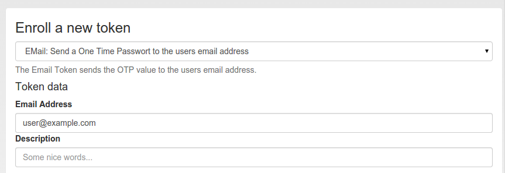

.. _email_token:

Email
-----

.. index:: Email token

The token type *email* sends the OTP value in an email to the users. You can
configure the email server in :ref:`email_token_config`.

   *Enroll an email token*

When enrolling an email token, you only need to specify the email address of
the user.

The email token is a challenge response token. I.e. when using the OTP PIN in
the first authentication request, the sending of the email will be triggered
and in a second authentication request the OTP value from the email needs to be
presented. It implements the :ref:`challenge authentication mode <authentication_mode_challenge>`.

For a more detailed insight see the code documentation :ref:`code_email_token`.
