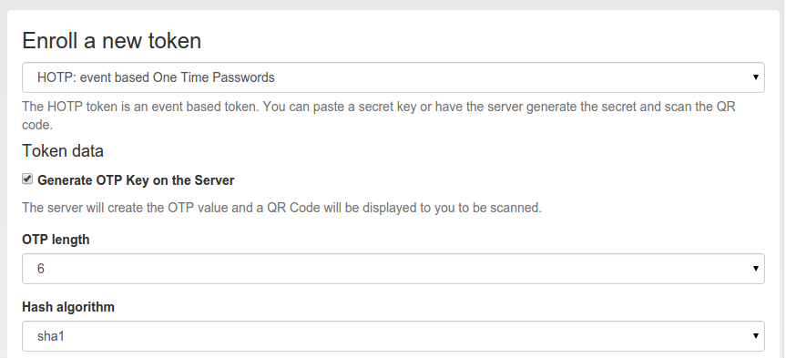
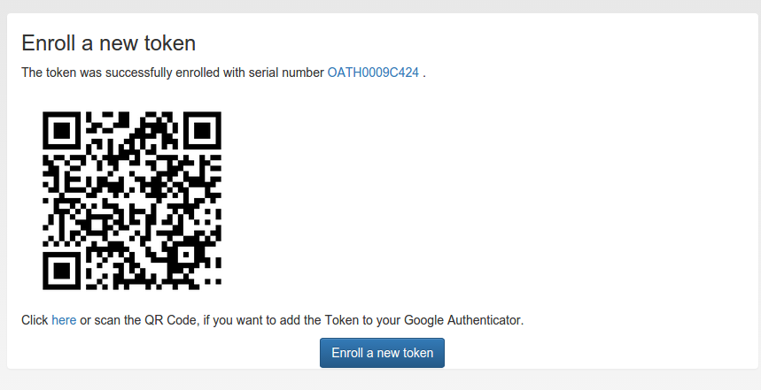

.. _hotp_token:

HOTP Token
----

The HOTP token is - together with the :ref:`totp_token` - the most common token.
The HOTP Algorithm is defined in
`RFC4225 <https://tools.ietf.org/html/rfc4226>`_. The HOTP token is an event
base token.
The HOTP algorithm has some parameter, like if the generated OTP value will
be 6 digits or 8 digits or if the SHA1 or the SHA256 hashing algorithm is
used.

The HOTP token implements the :ref:`authenticate mode <authentication_mode_authenticate>`.
With a suitable :ref:`policy_challenge_response` policy, it may also be used
in the :ref:`challenge mode <authentication_mode_challenge>`.

Hardware tokens
~~~~~~~~~~~~~~~

.. index:: HOTP tokens

There are many token vendors out there who are using the official algorithm
to build and sell hardware tokens. You can get HOTP based hardware tokens in
different form factors, as a normal key fob for your key ring or as a display
card for your purse.

Preseeded or Seedable
.....................

.. index:: preseeded, seedable

Usually the hardware tokens like keyfobs or display cards contain a secret
key that was generated and implanted at the vendors factory. The vendor ships
the tokens and a seed file.

.. warning:: In this case privacyIDEA can not guarantee that the secret seed of
   the token is unique and if you are using a real strong factor.

privacyIDEA also supports the following seedable HOTP tokens:

* SafeNet eToken NG OTP
* SafeNet eToken Pass
* Yubikey in OATH mode (See :ref:`yubikey_enrollment_tools` on how to enroll Yubikeys in HOTP mode.)
* Daplug

Those tokens can be initialized by privacyIDEA. Thus you can be sure, that
only you are in possession of the secret seed.

Experiences
...........

The above mentioned hardware tokens are known to play well with privacyIDEA.
In theory all OATH/HOTP tokens should work well with privacyIDEA. However,
there are good experiences with Smartdisplayer OTP cards [#smartdisplayer]_ and
Feitian C200 [#feitian]_
tokens.

Software tokens
~~~~~~~~~~~~~~~

Besides the hardware tokens there are also software tokens, implemented as
Apps for your smartphone.
These software tokens allow are seedable, so there is no vendor, knowing the
secret seed of your OTP tokens.

But software tokens are software after all on device prone to security issues.

Experiences
...........

The Google Authenticator can be enrolled easily in HOTP mode using
the QR-Code enrollment Feature.

The Google Authenticator is available for iOS, Android and Blackberry devices.

.. _hotp_token_enrollment:

Enrollment
~~~~~~~~~~

Default settings for HOTP tokens can be configured at :ref:`hotp_token_config`.

   *Enroll an HOTP token*

During enrollment you can choose, if the server should generate the key or if
you have a key, that you can enter into the enrollment page.

As mentioned earlier, you can also choose the **OTP length** and the **hash
algoriothm**.

   *If the server generated the secret seed, you can scan the QR-Code*

After enrolling the token, the QR-Code, containing the secret seed, is
displayed, so that you can scan this with your smartphone and import it to
your app.

.. [#smartdisplayer] https://netknights.it/en/produkte/smartdisplayer/
.. [#feitian] https://netknights.it/en/produkte/oath-hotptotp/
