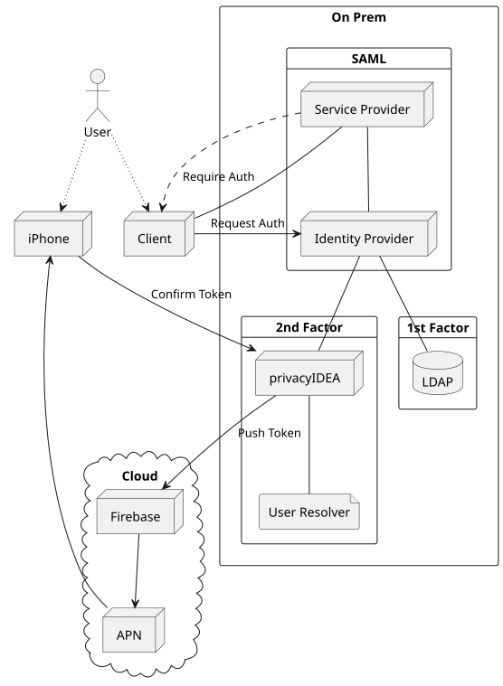

.. _push_token:

Push Token
----------

.. index:: Push Token, Firebase service, push gateway

The push token uses the *privacyIDEA Authenticator* app. You can get it
from `Google Play Store`_ or `Apple App Store`_.

.. _Google Play Store: https://play.google.com/store/apps/details?id=it.netknights.piauthenticator
.. _Apple App Store: https://apps.apple.com/us/app/privacyidea-authenticator/id1445401301

The token type *push* sends a cryptographic challenge via a configured
push-capable SMS gateway to the smartphone of the user. The built-in Firebase,
HTTP, and Script providers support PUSH messages. Firebase gateways are enabled
by default; HTTP and Script gateways require ``ALLOW_PUSH=yes``. This push
notification is displayed on the smartphone of the user with a text
that tells the user that he or somebody else requests to log in to a
service. The user can simply accept this request.
The smartphone sends a cryptographically signed response to the
privacyIDEA server and the login request gets marked as confirmed
in the privacyIDEA server. The application checks for this mark and
then finalizes the login with privacyIDEA. For an example of how the components in a
typical Firebase deployment of push tokens interact reference the following diagram.

   A typical push token deployment

To allow privacyIDEA to send push notifications, configure a push-capable SMS
gateway. See :ref:`sms_gateway_config` and :ref:`firebase_provider`.

The PUSH token implements the :ref:`outofband mode <authentication_mode_outofband>`.

Configuration
~~~~~~~~~~~~~

The minimum necessary configuration is the two ``enrollment`` policies
:ref:`policy_firebase_config` (a push-capable gateway, or ``poll only``) and
``push_registration_url``. Without ``push_registration_url`` the enrollment
fails with "Missing enrollment policy for push token: push_registration_url".

With the ``authentication`` policies :ref:`policy_push_text_on_mobile`
and :ref:`policy_push_title_on_mobile` you can define
the contents of the push notification.

If you want to use push tokens with legacy applications that are not yet set up to be compatible with out-of-band
tokens, you can set the ``authentication`` policy :ref:`policy_push_wait`. Please note, that setting this policy can
interfere with other tokentypes and will impact performance, as detailed in the documentation for ``push_wait``.

Enrollment
~~~~~~~~~~

The enrollment of the push token happens in two steps.

Step 1
......

The user scans a QR code. This QR code contains the
basic information for the push token and an enrollment URL, to which
the smartphone should respond in the enrollment process.

The smartphone stores this data and creates a new key pair.

Step 2
......

The smartphone sends its device token (named ``fbtoken`` in the enrollment API
for compatibility), the public key of the keypair,
the serial number and an enrollment credential back to the
enrollment URL of the privacyIDEA server.

The server responds with its public key for this token.

Authentication
~~~~~~~~~~~~~~

Triggering the challenge
........................

The authentication request is triggered by an application
just as for any
challenge-response token either with the PIN to the
endpoint ``/validate/check`` or via the endpoint
``/validate/triggerchallenge``, which requires the authorization token of an
administrator with the admin policy :ref:`policy_triggerchallenge`.

privacyIDEA sends a cryptographic challenge with a signature to the configured
push gateway. The gateway sends the notification to the smartphone,
which can verify the signature using the public key from enrollment step 2.

Accepting login
...............

The user can now accept the login by tapping on the push notification.
The smartphone sends the signed challenge back to the authentication URL
of the privacyIDEA server.
The privacyIDEA server verifies the response and marks this authentication
request as successfully answered.

In some cases the push notification does not reach the smartphone. The
smartphone can also poll for active challenges.

Declining login
...............

Instead of accepting, the user can decline the request. The app signs a reason
together with its answer and thus distinguishes two cases: the user did not
trigger this login at all (``unknown_trigger``), or triggered it and aborted
(``cancelled``). The first marks the challenge as *declined*, the second as
*cancelled*, which ``/validate/polltransaction`` reports as the
``challenge_status``, so that the application can react accordingly.

Every answer the server acts on is written to the audit log. The
``action_detail`` of the entry of the answer (``POST /ttype/push``) names the
transaction and the resulting status -- ``accept``, ``declined``, ``cancelled``,
or ``confirmed`` for the smartphone step of code_to_phone -- plus the reason the
app sent with a refusal. An answer the server rejects, such as a wrong or
missing presence answer, records no status: there is no outcome to name, and the
challenge stays open for another try. The authentication that fails because of a
refusal names transaction and status as well. An app sending a reason this
server version does not know declines the challenge like an app that sends no
reason at all; the value it did send is only visible in the audit entry of the
answer.

The two reasons are also separate events in the authentication log, so
conditional access can act on them differently:
``CHALLENGE_DECLINED_UNKNOWN_TRIGGER`` for the login the user says they did not
start, ``CHALLENGE_CANCELLED`` for the one they abandoned themselves, and the
plain ``CHALLENGE_DECLINED`` where no usable reason was sent. The first is the
user reporting somebody else's attempt and deserves a policy with a low
threshold; the last is deliberately the fallback for an unknown reason, so a
value a newer app invents is never read as that report. See
:ref:`authentication_log_event_types`.

These types are recorded for the app's answer at ``/ttype/push``. When the
client then finalizes the declined challenge with ``/validate/check``, that
request is recorded as ``CHALLENGE_CANCELLED`` for a canceled push and as
``CHALLENGE_DECLINED`` for every other decline, including one the user marked
as not started by them. A policy that counts ``CHALLENGE_DECLINED`` therefore
also counts those finalizing requests.

Login to application
....................

The application polls ``/validate/polltransaction`` with the original
transaction ID. Once it returns ``true``, the application must send
``/validate/check`` with the user, the transaction ID and an empty ``pass``.
Only the result of this request decides the login, because only
``/validate/check`` applies the authentication and authorization policies (see
:ref:`authentication_mode_outofband`).

Challenge lifetime
..................

As an out-of-band token (see :ref:`authentication_modes`), a push challenge has
two consecutive time windows:

* **Answer window** -- the time the smartphone has to accept or decline the
  challenge. It is controlled by ``PushChallengeValidityTime`` (falling back to
  ``DefaultChallengeValidityTime``, 120 seconds). A response that arrives after
  this window is rejected.
* **Finalize window** -- once the smartphone has answered, the challenge
  expiration is pushed out to at least ``PushChallengeFinalizeGrace`` seconds
  (default 300) from the moment it was answered, so that the application can
  still read the outcome via ``/validate/polltransaction`` (after a refusal,
  ``challenge_status`` is ``declined`` or ``cancelled``) and finalize the
  authentication via ``/validate/check``. ``/validate/check`` answers a refused
  challenge with a plain reject; the reason the app sent is recorded in the
  audit log and the authentication log (see *Declining login* above). The
  expiration only ever moves forward, so with an answer window
  longer than the grace period, the challenge may stay redeemable until its original
  expiration. Once the challenge finally expires it can no longer be redeemed.

During enrollment via :ref:`policy_enroll_via_multichallenge`, the user has to
scan the QR code and the app has to complete the second enrollment step within
the answer window (``PushChallengeValidityTime``). The finalize window then
bounds how long the application can finalize the enrollment via
``/validate/check``. If the app completes the second step after the answer
window, the token is still enrolled, but the login that started the enrollment
fails and has to be repeated. Both windows behave identically whether or not
the Redis challenge cache is enabled.

More information
~~~~~~~~~~~~~~~~

For a more detailed insight see the code documentation for the :ref:`code_push_token`.

For an in depth view of the protocol see
`the GitHub issue <https://github.com/privacyidea/privacyidea/issues/1342>`_ and
`the wiki page <https://github.com/privacyidea/privacyidea/wiki/concept%3A-PushToken>`_.

Information on the polling mechanism can be found in the `corresponding wiki page <https://github
.com/privacyidea/privacyidea/wiki/concept%3A-pushtoken-poll>`_.

For recent information and a setup guide, visit the
`community blog <https://www.privacyidea.org/tag/push-token/>`_
