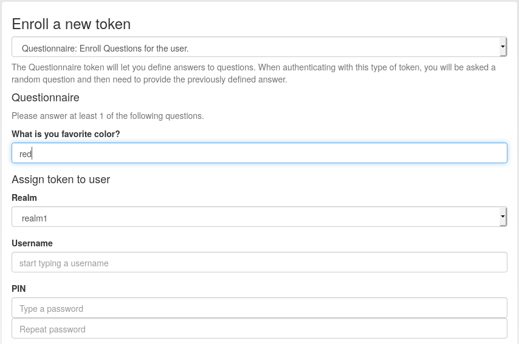

.. _questionnaire_token:

Questionnaire Token
-------------------

.. index:: Questionnaire Token, Question Token

The administrator can define a list of questions and also how many answers to
the questions a user needs to define.

During enrollment of such a *questionnaire* type token, the user answers at least as
many questions as specified by the administrator with answers only he knows.

This token is a challenge response token.
During authentication the user gives the token PIN before he is presented with a random
question to which he defined the answer during the token rollout.

.. note:: By default, no questions are defined, so the administrator has to setup those
   in "Config->Tokens->Questionnaire" before a questionnaire token can be rolled out successfully.

.. note:: If the administrator changes the questions *after* a token was
   enrolled, the enrolled token still works with the old questions and answers.
   I.e. an enrolled token is not affected by changing the questions by the
   administrator.

.. note:: As for all token, it is not changed after the rollout (see above note),
   so a change of the answers of an existing token is not possible.
