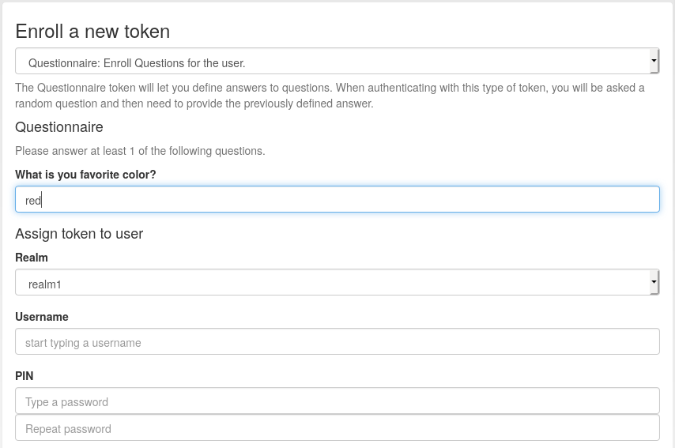

.. _questionnaire_token:

Questionnaire Token
-------------------

.. index:: Questionnaire Token, Question Token

The administrator can define a list of questions and also how many answers to
the questions a user needs to define. If the number is not configured, the
user has to answer at least 5 questions during enrollment.

During enrollment of such a *questionnaire* type token, the user answers at least as
many questions as specified by the administrator with answers only he knows.

This token is a challenge response token.
During authentication the user gives the token PIN before he is presented with a random
question to which he defined the answer during the token rollout.
With the authentication policy ``question_number`` (see :ref:`authentication_policies`)
the user has to answer several questions one after the other.

.. note:: By default, no questions are defined, so the administrator has to set up those
   in *Configuration > Tokentypes > Questionnaire* before a questionnaire token can be rolled out successfully.

.. note:: If the administrator changes the questions *after* a token was
   enrolled, the enrolled token still works with the old questions and answers.
   I.e. an enrolled token is not affected by changing the questions by the
   administrator.

.. note:: Single answers of an enrolled token can not be edited. Enrolling the
   token again with the same serial (rollover) replaces all its questions and
   answers.
