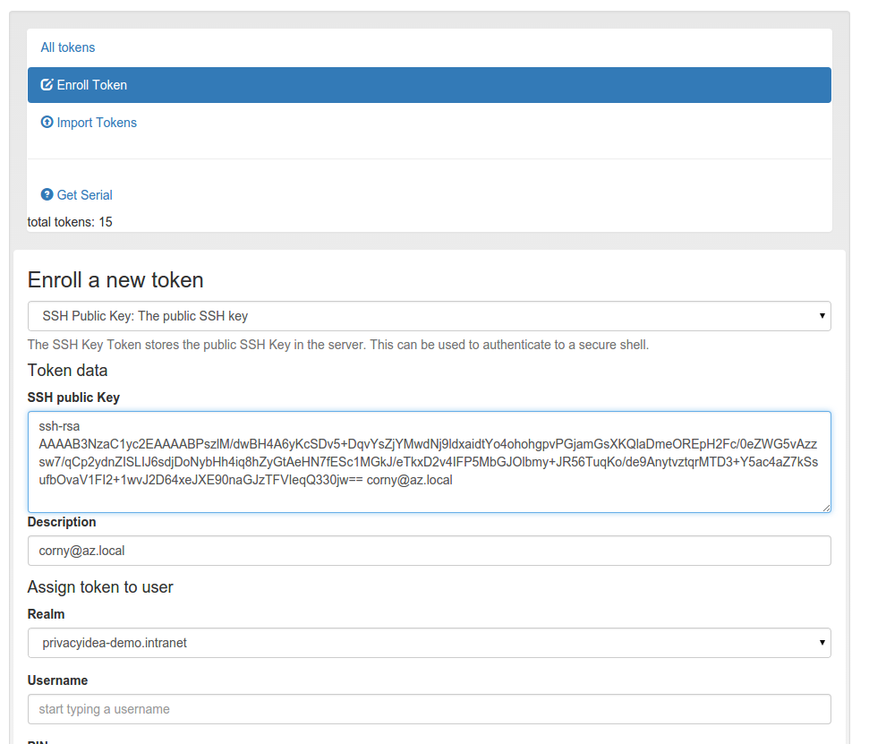

.. _sshkey_token:

SSH Keys
--------

.. index:: SSH keys

The token type *sshkey* is the public SSH key, that you can upload and assign
to a user. The SSH key is only used for the application type **SSH** in
conjunction with the :ref:`machines` concept.

A user or the administrator can upload the public SSH key and assign to a user.

   *Enroll an SSH key token*

Paste the SSH key into the text area. The comment in the SSH key will be used as
token comment.
You can assign the SSH key to a user and then use the SSH key in Application
Definitions :ref:`application_ssh`.

.. note:: This way you can manage SSH keys centrally, as you do not need to
   distribute the SSH keys to all machines. You rather store the SSH keys
   centrally in privacyIDEA and use **privacyidea-authorizedkeys** to fetch
   the keys in real time during the login process.

Reading the public key
~~~~~~~~~~~~~~~~~~~~~~~~

.. versionadded:: 3.14

The public SSH key is stored encrypted in the database and is therefore only
contained in encrypted form in the token list. To
retrieve the assembled public key (``<type> <key> [<comment>]``), use the
endpoint ``GET /token/sshkey/<serial>``. Access is guarded by the policy
action ``sshkey_read`` in the scopes ``admin`` and ``user``. A user may only
read the SSH key of their own tokens.

Integrity protection
~~~~~~~~~~~~~~~~~~~~~~

.. versionadded:: 3.14

The public SSH key is stored encrypted in the database. In addition,
privacyIDEA stores an integrity checksum of the SSH key data (serial, key
type, public key and comment) in the encrypted OTP key field of the token.
The checksum is verified whenever the SSH key is fetched. This way a
manipulation of the database entries - e.g. a database administrator
replacing the public key to gain access to SSH servers - is detected and the
SSH key is not handed out.

.. note:: SSH key tokens enrolled with privacyIDEA versions before 3.14 get
   their checksum computed by the database migration during the update. If
   the checksum is missing (e.g. the migration was not run), the token will
   refuse to hand out the SSH key.

.. _sshkey_allowed_key_types:

Allowed key types
~~~~~~~~~~~~~~~~~~

By default the following SSH key types can be enrolled:

* ``ssh-rsa``
* ``ssh-ed25519``
* ``ecdsa-sha2-nistp256``
* ``sk-ecdsa-sha2-nistp256@openssh.com``
* ``sk-ssh-ed25519@openssh.com``

Additional key types can be allowed with the configuration entry
``PI_ALLOWED_SSH_KEY_TYPES`` in ``pi.cfg``, see
:ref:`picfg_allowed_ssh_key_types`.
