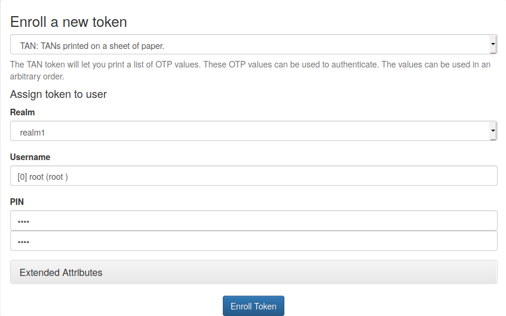
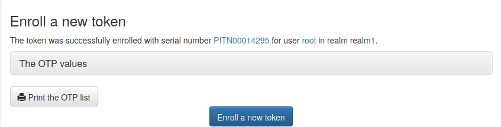

.. _tan_token:

TAN Token
---------

.. index:: TAN Token

(added in version 2.23)

The token type *tan* is related to the :ref:`paper_token`.

In contrast to the *paper* token, a user can use the OTP values of a *tan* token in
any arbitrary order.

A *tan* token can either be initialized with random OTP values. In this case the HOTP mechanism is used.
Or it can be initialized or imported with a dedicated list of TANs.

After enrollment, you are prompted to print the generated TAN list.

Import of TAN token
~~~~~~~~~~~~~~~~~~~

The import schema for TAN tokens via the OATH CSV file look like this:

    <serial>, <seed>, tan, <white space separated list of tans>

The TANs are located in the 4th column. TANs are separated by blanks or whitespaces.
The *<seed>* is not used with a TAN token. You can leave this blank or set to any (not used) value.