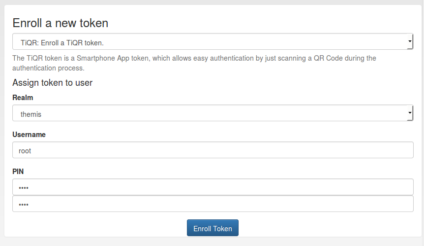
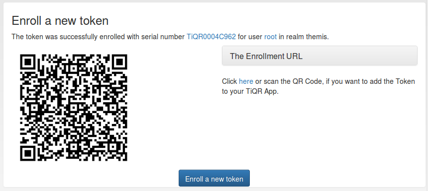

.. _tiqr_token:

TiQR
----

.. index:: TiQR, OCRA

privacyIDEA supports the TiQR token.
The TiQR token is a smartphone token, that can be used to log in by only
scanning a QR code.

The TiQR token implements the
:ref:`outofband authentication mode <authentication_mode_outofband>`.
The configuration is described in :ref:`tiqr_token_config`.

The token is also enrolled by scanning a QR code.

   *Choose a user for the TiQR token*

.. note:: You can not enroll a TiQR token without assigning the token to a user.

For more technical information about the TiQR token please see
:ref:`code_tiqr_token`.
