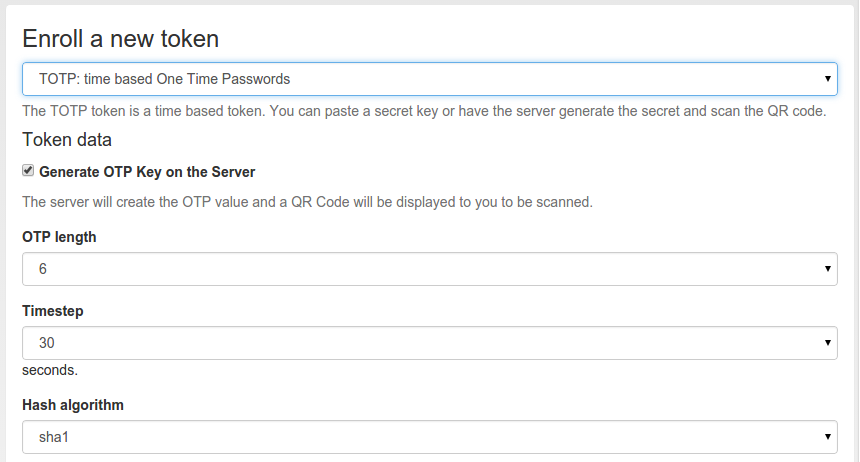

.. _totp_token:

TOTP
----

The TOTP token is - together with the :ref:`hotp_token` - the most common token.
The TOTP Algorithm is defined in
`RFC6238 <https://www.rfc-editor.org/rfc/rfc6238>`_.
The TOTP token is a time based token.
Roughly speaking the TOTP algorithm is the same algorithm as HOTP,
where the event based counter is replaced by the unix timestamp.

The TOTP algorithm has some parameters, like if the generated OTP value will
be 6 digits or 8 digits or if the SHA1, SHA256 or SHA512 hashing algorithm is
used and the timestep being 30 or 60 seconds.

The TOTP token implements the :ref:`authenticate mode <authentication_mode_authenticate>`.
With a suitable :ref:`policy_challenge_response` policy, it may also be used
in the :ref:`challenge mode <authentication_mode_challenge>`.

Hardware tokens
~~~~~~~~~~~~~~~

The information about preseeded token and seedable tokens is the same as
described in the section about :ref:`hotp_token`.

The YubiKey can be used as a TOTP token, but only in conjunction with a
smartphone app, since the YubiKey does not have an internal clock.

Software tokens
~~~~~~~~~~~~~~~

Experiences
...........

The Google Authenticator and the FreeOTP token can be enrolled easily in
TOTP mode using
the QR-Code enrollment feature.

The Google Authenticator is available for iOS and Android devices.

Enrollment
~~~~~~~~~~

Default settings for TOTP tokens can be configured at :ref:`totp_token_config`.

The enrollment is the same as described in :ref:`hotp_token`.
However, when enrolling a TOTP token, you can specify some additional parameters.

   *Enroll a TOTP token*
