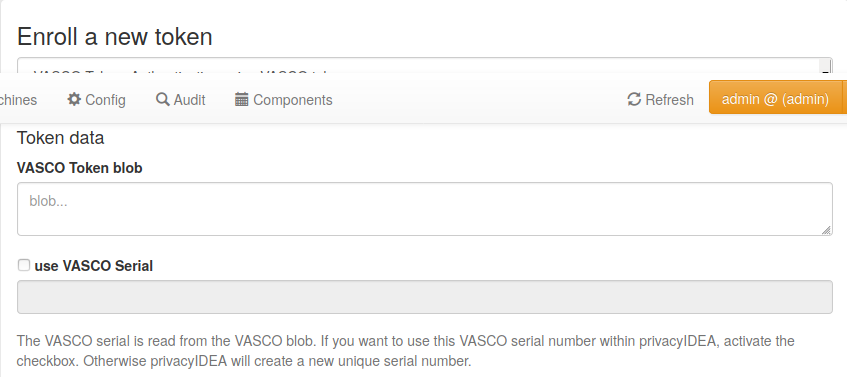

.. _vasco_token:

OneSpan (VASCO)
---------------

.. index:: VASCO, OneSpan

privacyIDEA supports OneSpan (formerly VASCO) tokens with the token type ``vasco``.

OneSpan OTP tokens are proprietary OTP tokens. You can import
the token blobs from a CSV file or the administrator can enroll
a single token.

.. note:: privacyIDEA uses the proprietary VACMAN Controller library from OneSpan to verify
   the OTP values. Please note that you need to license this library from
   OneSpan directly. The privacyIDEA project does not
   provide this library.

Set the path to the shared library with ``PI_VASCO_LIBRARY`` in ``pi.cfg``::

    PI_VASCO_LIBRARY = "/path/to/the/vendor/library.so"

The option has no default. If it is not set or the library cannot be loaded,
tokens of the type ``vasco`` cannot be used to authenticate. See also :ref:`picfg_vasco_library`.
