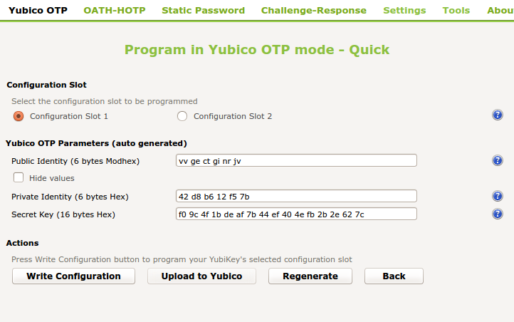
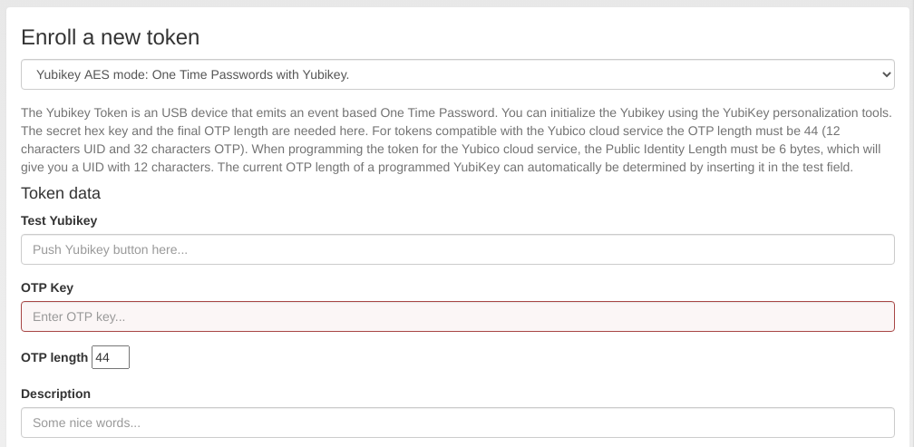
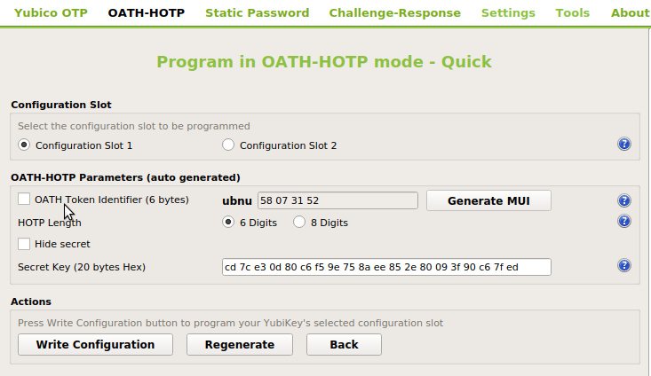
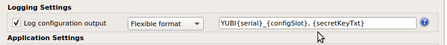
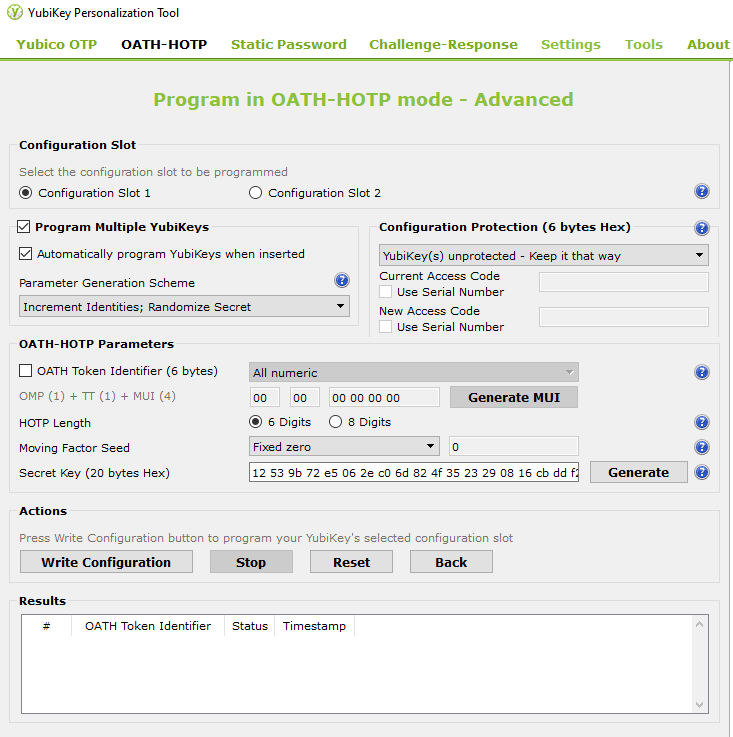

.. _yubikey_token:

Yubikey
-------

.. index:: Yubikey, Yubico AES mode, Yubikey OATH-HOTP mode

The Yubikey can be used with privacyIDEA in Yubico's own AES mode (*Yubico OTP*)
or in the OATH-HOTP mode which is for privacyIDEA a HOTP Token.

In AES mode it outputs a 44 character OTP value, consisting of a 12 character prefix and
a 32 character OTP. But in contrast to the :ref:`yubico_token` Cloud
mode, in this mode the secret key is contained within the token and your own
privacyIDEA installation. In OATH-HOTP mode, it just prints a series of 6 or 8 digits.

If you have the time and care about privacy, you should prefer the
Yubikey AES mode or OATH-HOTP mode over the :ref:`yubico_token` Cloud mode.

As for all hardware-tokens, the Yubikey has to be initialized with privacyIDEA
to bring the token secrets to the system.

privacyIDEA enrollment Tools
============================

privacyIDEA ships several tools to enroll a Yubikey in AES mode (Yubikey Token).

privacyidea CLI tool
~~~~~~~~~~~~~~~~~~~~

For Linux Clients, there is the ``privacyidea`` command line
client, to initialize the Yubikeys. You can use the mass enrollment, which
eases the process of initializing a whole bunch of tokens.

Run the command like this::

   privacyidea -U https://your.privacyidea.server -a admin token \
   yubikey_mass_enroll --yubimode YUBICO

This command initializes the token and stores the AES secret and prefix
in privacyidea, so the token is immediately useful. You can choose the slot
with ``--yubislot``. For further help call
``privacyidea yubikey_mass_enroll`` with the ``--help`` option.

yubikey_mass_enroll
~~~~~~~~~~~~~~~~~~~

The second way to enroll a yubikey token is also using ``yubikey_mass_enroll``,
but with the option ``--filename`` to write to token configuration into the
specified file.  The resulting file can then be imported into privacyidea:
Select Tokens -> Import Tokens, select "OATH CSV" and the file you just created.

.. _ykpersgui:

.. index:: Yubikey, Yubikey personalization GUI, Yubikey personalization tool

Yubikey Personalization GUI
===========================

You can also initialize the Yubikey with the official Yubico personalization tool
[#ykpers]_ and use the obtained secret to enroll the Yubikey with privacyIDEA.
For both AES (Yubico OTP) and OATH-HOTP mode, there are two possibilities to initialize
the Yubikey with privacyIDEA.

Single token enrollment
~~~~~~~~~~~~~~~~~~~~~~~

To initialize a single Yubikey in AES mode (Yubico OTP) use the *Quick* button and
copy the shown secret labeled with "Secret Key (16 bytes Hex)" to the field *OTP Key*
on the enrollment form in the privacyIDEA WebUI.

   *Initialize a Yubikey in AES mode (Yubikey OTP)*

   *Enroll a Yubikey AES mode token in privacyIDEA*

In the field "Test Yubikey" push the Yubikey button. This will determine the
length of the *OTP value* and the field *OTP length* is automatically filled.

.. note::
    The length of the unique passcode for each OTP is 32 characters at the end
    of the OTP value. The remaining characters at the beginning of the OTP value
    form the Public ID of the device. They remain constant for each
    OTP [#ykotp]_.

    privacyIDEA takes care of separating these parts but it needs to know the
    complete length of the OTP value to work correctly.

The process is similar for the OATH-HOTP mode. You have to deselect *OATH Token Identifier*.
Copy the shown secret to the HOTP enrollment form in privacyIDEA.

   *To initialize a single Yubikey in OATH-HOTP mode, deselect OATH Token Identifier.*

.. note::
    In the case of OATH-HOTP mode privacyIDEA does not know that the token is a Yubikey.
    To set an identifying token serial, consider to use the advanced mode (see below).

Mass enrollment
~~~~~~~~~~~~~~~

To initialize one or more Yubikeys and to write the configuration to an output file use the
*Advanced* button. The configured secrets are imported afterwards in the WebUI. After plugging
the Yubikey, it will be detected and the selected configuration slot is initialized upon
*Write Configuration* as before. You will be prompted to select an output file name.
The secrets are written to this file in the format set in *Settings* -> *Log configuration output*.
We recommend to select *Yubico format*, PSKC is also supported. You may also use a custom output
configuration to set custom token serials upon import using :ref:`import_oath_csv`.

   *Besides Yubico and PSKC, the flexible format enables custom serials for OATH-HOTP tokens*

   *Write Configuration initializes the Yubikey*

The tool is also able to do a mass-initialization by selecting *Program multiple Yubikeys* and
plugging one Yubikey after the other. During this process the token secrets are automatically
appended to the selected export file. Note again, that for OATH-HOTP, you have to deselect
*OATH Token Identifier*.

After mass-initialization, the token secrets have to be imported to privacyIDEA (see :ref:`import`).

Redirect api url to privacyideas /ttype/yubikey
...............................................

Yubico servers use ``/wsapi/2.0/verify`` as the path in the
validation URL. Some tools (e.g. Kolab 2fa) let the 
user/admin change the api host, but not the rest of
the URL. Let's redirect the api URL to privacyIDEA's
/ttype/yubikey - you'll need to enable the following two 
lines in /etc/apache2/site-enabled/privacyidea.conf:

    RewriteEngine  on
    RewriteRule    "^/wsapi/2.0/verify"  "/ttype/yubikey" [PT]

If you use nginx there is a similar line provided as a comment
to the nginx configuration as well.

.. rubric:: Footnotes

.. [#ykpers] https://www.yubico.com/products/services-software/download/yubikey-personalization-tools/
.. [#ykotp] https://developers.yubico.com/OTP/OTPs_Explained.html
