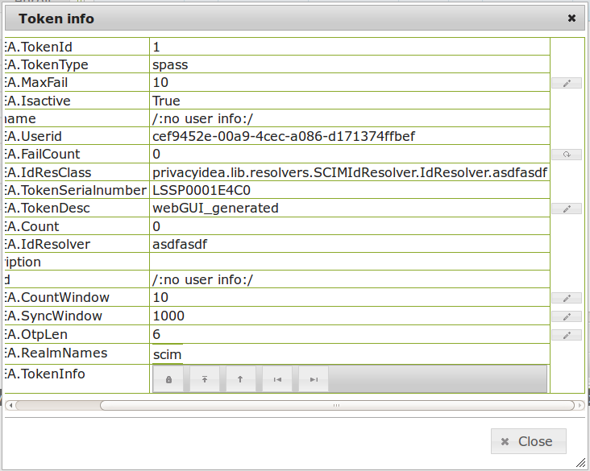

.. _tokenview:

Tokenview
=========

.. index:: tokenview

The administrator can see all the tokens of all realms he is allowed to manage in the
tokenview. Each token can be located in several realms and be assigned to one 
user. The administrator can see all the details of the token.

The administrator can select one or more tokens to perfom actions on the
selected tokens.

Functions for one token
-----------------------

The buttons on the top ``Lost token``, ``Token info``, ``Resync Token``, ``set token realm``
and ``get OTP`` are functions that work on one single token.

.. index:: Lost token

Lost token
..........

When a user has lost a token, the administrator can create a temporary password
token for the user to login.

The administrator has to select the token that was lost and click the button 
``Lost token``. A new token of type *PW* is generated. The OTP PIN of the
old token is automatically copied to the new token. Thus the administrator
does not know the OTP PIN, while the user can use his old PIN.

A long password is displayed to the administrator and the administrator
can read this password to the user. The user now can authenticate
with his old OTP PIN and the long password.

The lost token is deactivated.

.. _tokeninfo:

Token info
..........

.. index:: maxfail, failcount, token description, count window

The ``Token info`` button opens a new dialog.
   

   *The tokeninfo dialog with all token details*

In tokeninfo you can change the following settings:

**MaxFail and FailCount**

   If the login fail counter reaches the ``MaxFail`` the user can not login
   with this token anymore. The Failcounter ``FailCount`` has to be reset
   to zero.

**TokenDesc**

   The token description is also displayed in the tokenview. You can 
   set a description to make it easier to identify a token.

**CountWindow**

   The ``CountWindow``  is the look ahead window of event based tokens.
   If the user pressed the button on an event based token the counter
   in the token is increased. If the user does not use this otp value
   to authenticate, the server does not know, that the counter in the 
   token was increased. 
   This way the counter in the token can get
   out of sync with the server. 

.. index:: syncwindow, out of sync

**SyncWindow**

   If a token was out of sync (see ``CountWindow``), then it needs to
   be synchronized. This is done by entering two consecutive OTP values.
   The server searches these two values within the next ``CountWindow`` 
   (default 1000) values.

.. index:: OTP length

**OtpLen**

   This is the length of the OTP value that is generated by the token.
   The password that is entered by the user is splitted according to
   this length. 6 or 8 characters are splitted as OTP value and the
   rest is used as static password (OTP PIN).

**Hashlib**

   The HOTP algorith can be used with SHA1 or SHA256.

**Auth max**

   The administrator can set a value how often this token 
   may be used for authentication. If the number of authentication
   try exceed this value, the token can not be used, until this
   ``Auth max`` value is increased.

.. note:: This way you could create tokens, that can be used only once.

**Auth max success**

   The administrator can set a value how often this token
   may be used to successfully authenticate.

**Valid start**

   A timestamp can be set. The token will only be usable for authentication
   after this start time.

**Valid end**   

   A timestamp can be set. The token can only be used before this end time.
  
.. note:: This way you can create temporary tokens for guests or 
   short time or season employees.

Resync Token
............
.. index:: resync token

The administrator can select one token and then enter two consecutive 
OTP values to resynchonize the token if it was out of sync.

set token realm
...............

A token can be assigned to several realms. This is important if you
have administrators for different realms.
A realm administrator is only allowed to see tokens within his realms.
He will not see tokens, that are not in his realm.
So you can assign a token to realm A and realm B, thus the administrator A
and the administrator B will be able to see the token.

get OTP
.......

If the corresponding getOTP policy (:ref:`policies`) is set, the administrator
can get the OTP values of a token from the server without having the token
with him.

.. note:: Of course this is a potential backdoor, since the administrator
   could login as the user/owner of this very token.

Functions for multiple tokens
-----------------------------

On the left side there are buttons for functions, that can be performed on several 
tokens at once.

The administrator can select multiple tokens and click on of the buttons.

.. _enroll_token:

enroll
......

.. index:: enroll token

For this function you do not need to select any token. But you can
select a user on the userview, then the token to be enrolled will be
directly assigend to this user.

When enrolling the token, you can choose, which token type you want
to enroll. After enrolling the token, you can set a OTP PIN for this 
token.

assign
......

This function is used to assign a token to a user.
The administrator can select one user on the userview and then 
select several tokens on the tokenview. 
Clicking the button ``assign`` will assign all tokens to the 
selected user.

unassign
........

The administrator can select several tokens and click the button 
``unassign``. If a token is unassigned it does not belong the user 
anymore. The user can not use this token to authenticate.

enable
......

If a token is disabled, it can be enabled again.

disable
.......

Tokens can be disabled. Disabled tokens still belong to the assigned user
but those tokens can not be used to authenticate. Disabled tokens can
be enabled again.

set PIN
.......

You can set the OTP PIN or the mOTP PIN for tokens.

Reset Failcounter
.................

If a used locked his token, since he entered wrong OTP values or
wrong OTP PINs, the fail counter has reached the mail failcount.
The administrator or help desk user can select those tokens and
click the button ``reset failcounter`` to reset the fail counter
to zero.
The tokens can be used for authentication again.

delete
......

Selecting tokens and clicking the button ``delete`` will remove the
tokens from the database.
The token information can not be recovered. But all events that
occured with this token still remain in the audit log.

Columns
-------

The columns of the tokenview can be rearranged and you can sort 
the columns.

Underneath the list is a search field. You can search for tokens
with certain criteria in the columns. You can use the  wildcard "*".

You could dearch for "10" in the column "count", thus finding all 
tokens that have reached the maximum fail count.

The list of the tokens provides detailed information on the tokens.

**active**

   This indicates if the token is enabled or disabled.

**username**

   This is the username of the user the token is assigned to.
   This is the name that is used to login.

.. note:: If it displays */:no user info:/* this indicates that
   the UserIdResolver is not able to determine the loginname/username.

   You should check the UserIdResolver and the log file for errors.
   
**realm**
  
   A token can be assigned to several realms. This column either displays
   one realm or several realms.

**count**

   This is the failcounter. You can keep track, if the user has problems
   logging in.
   If this value reaches the ``max failcount`` the token can not be used
   to authenticate anymore until the failcounter is resetted.

**max failcount**

   This works with the ``count`` column.

**userid / resolver**

   These columns represent the assignment to the user. 
   Depending on the resolver and type of resolver the ``userid``
   can look different. This can be an integer, a distinguished name
   or an objectGUID or entryUUID.

