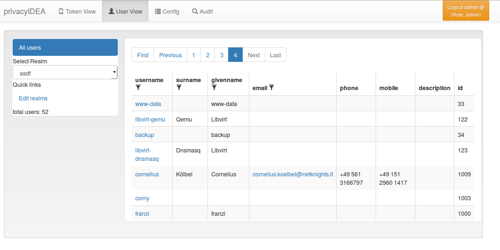
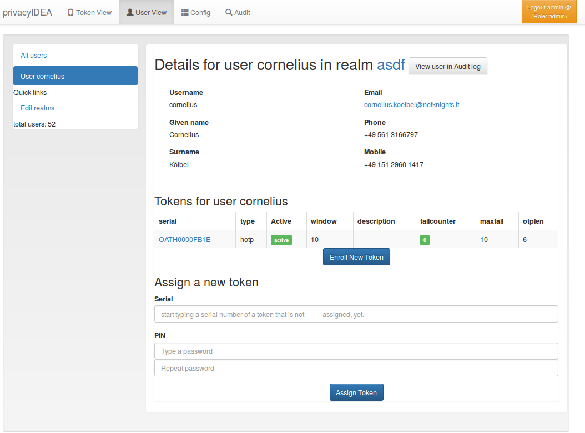

.. _userview:

Userview
=========

.. index:: userview

The administrator can see all users in **realms** he is allowed 
to manage. 

.. note:: Users are only visible, if the useridresolver is located 
   within a realm. If you only define a useridresolver but no realm,
   you will not be able to see the users!

You can select one of the realms in the left drop down box. The administrator
will only see the realms in the drop down box, that he is allowed to manage.
**(TODO)** No migrated, yet.

   *User View. List all users in a realm.*

The list shows the users from the select realm. The username, surname,
given name, email and phone are filled according to the definition of 
the useridresolver. 

Even if a realm contains several useridresolvers all users from all
resolvers within this realm are displayed.

As privacyIDEA only reads users from user sources the actions you can 
perform on the users are limited.

.. note:: You can not create or modify users in privacyIDEA!

.. _user_details:

User Details
------------

When clicking on a username, you can see the users details and perform
several actions on the user.

   *User Details.*

You see a list of the users tokens and change to the :ref:`token_details`.

Enroll tokens
.............

In the users details view you can enroll additional tokens to the user. In
the enrollment dialog the user will be selected and you only need to choose
what tokentype you wish to enroll for this user.

Assign tokens
.............

You can assign a new, already existing token to the user. Just start typing
the token serial number. The system will search for tokens, that are not
assigned yet and present you a list to choose from.

View Audit Log
..............

You can also click *View user in Audit log* which will take you to the
:ref:`audit` log with a filter on this very user, so that you will only see
audit entries regarding this user.
