.. _container_functionality:

Functionality of the Container View
-----------------------------------

Administrators can see and edit all containers of the realms they are allowed to manage. A container can be in several
realms. This enables the possibility that administrators of different realms can manage the same container.
Users can only see and edit their own containers.

The container view submenu contains four parts: Container list, container details, create container and templates.

Container List
~~~~~~~~~~~~~~

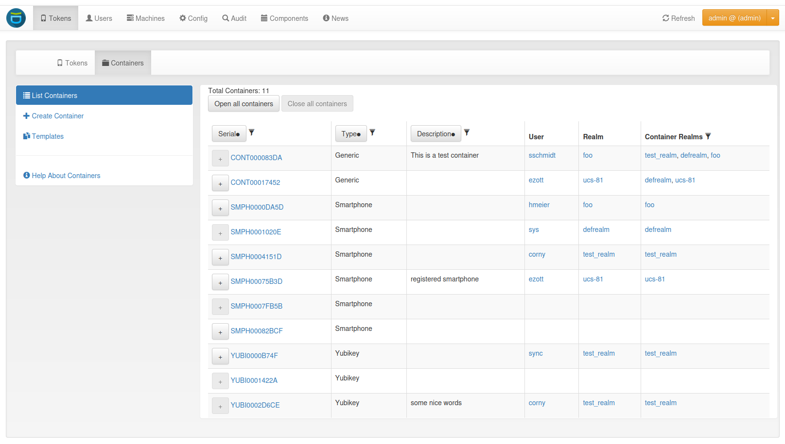

   *Container List*

The container list displays all containers that the user or administrator is allowed to see. To view all the tokens
contained in a container, click on the container's row. Clicking on the container
serial will open the container details page.

The container list can be filtered by the serial, type, description, state, user, realm of the user, container realm,
the serial of a contained token, the template and whether a user is assigned. The list can also be sorted by the
serial, type, and description in ascending and descending order.

Container Details
~~~~~~~~~~~~~~~~~

The container details page displays all container attributes. The administrator and privileged users can perform
different actions on the container and the contained tokens.

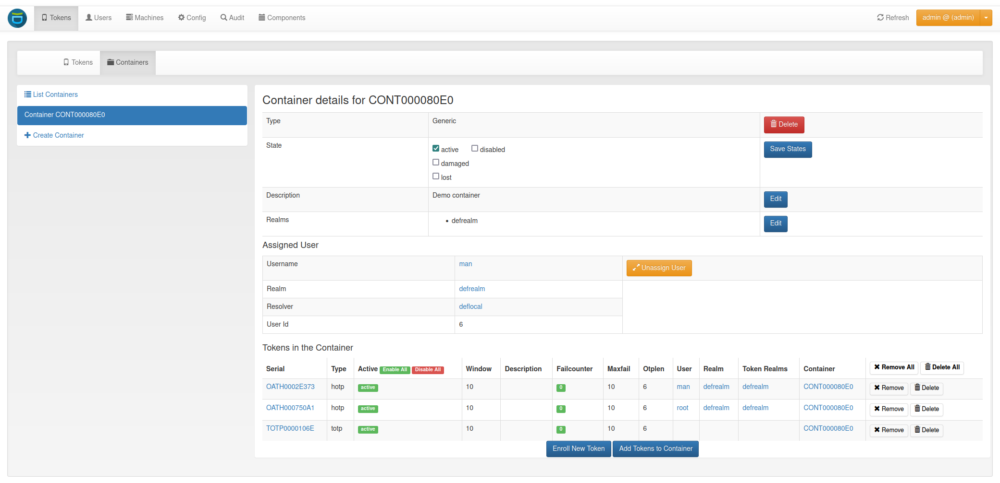

   *Container Details*

Delete
......

Clicking *Delete* deletes the container after a confirmation; the tokens it contains are kept. To delete the tokens
as well, use *Delete All* in the *Actions* menu of the token list. Tokens the user is not allowed to manage will not be
deleted.

States
......

A container can be in multiple states. However, there are also states that exclude each other, e.g. active and
disabled. When editing the states, selecting one of two exclusive states deselects the other, and at least one state
must be selected. Editing the states requires the policy action ``container_state``.

Realms
......

A container can be in multiple realms even without having a specific user assigned. If a user is assigned, the container
is automatically in the realm of the user. This realm can not be removed without unassigning the user.

User
....

To assign a user, click the *Assign User* button, select a realm in *Select Realm of User* and start typing the user's
name in *Enter User*. Select one of the suggested users and save the assignment. Clicking on the assigned
user's name redirects to the :ref:`user_details` page.

Template
........

If the container was created from a template, the template name is displayed.

Additionally, the container can be compared to the template. This is useful if the template was changed after the
container was created. Clicking *Compare to Template* marks the differences in the token list. The number of tokens of
each token type is compared: for every token the template defines but the container lacks, a row with the serial
``MISSING`` is added, and tokens beyond the number the template defines for their type are highlighted, also if the
type is in the template.

Synchronization
...............

Beginning from version 3.11, smartphones can be synchronized with the container on the privacyIDEA server. To enable
the synchronization, registration is required first.
The registration is initiated with *Register* in the *Container Actions*, which opens the *Register Container* dialog.

Optionally, the user can secure the registration with a passphrase. For this, a prompt that will be displayed to the
user in the authenticator app (*Passphrase Prompt*), and the correct passphrase response (*Passphrase Response*) can be
configured. Another possibility is to simply use the passphrase from the user store (*Validate the passphrase against
the user store.*, added in version 3.12). This requires that the container is assigned to a user.
When the passphrase shall be evaluated against the user store you can optionally specify a prompt, otherwise a default
prompt will be displayed.

After clicking *Register* in the dialog, a QR code is displayed. The user has to
scan this QR code with the privacyIDEA Authenticator app to complete the registration.

.. note:: It is required to configure a container policy specifying at least the :ref:`container_policy_server_url`
    action. See :ref:`container_policies` for more information.

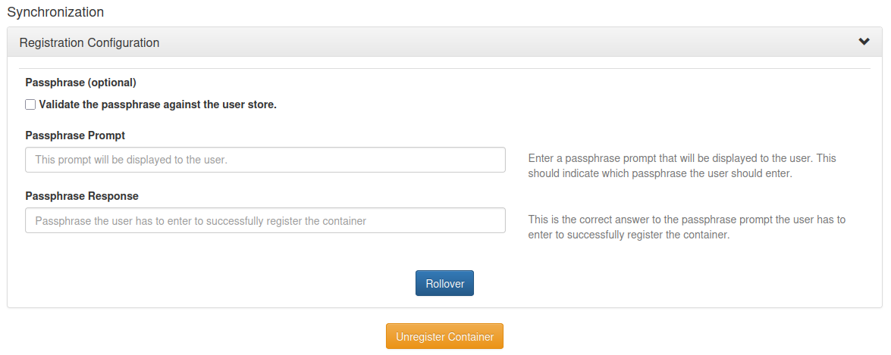

   *Synchronization Section on the Container Details Page*

If the smartphone is successfully registered, the *Registration State* changes from ``client_wait``
to ``registered``. In case the QR code gets lost or the passphrase needs to be changed, the QR code can be regenerated
by clicking *Register* again. However, this is only possible while the registration is in the
``client_wait`` state.

The time of the last successful authentication with a token of the container (*Last Authentication*) is displayed for
every container. For registered containers, the time of the last synchronization (*Last Synchronization*) is displayed
as well. Both timestamps are reset when a registration or a rollover is started, hence they are not set yet for a newly
registered container.

If the container with all tokens shall be registered on a new smartphone, a rollover can be performed. Similar to
the registration, clicking *Rollover* opens the *Container Rollover* dialog, where you can set a passphrase and
generate a new QR code. The user has to scan the QR code with the new smartphone. If the new smartphone
has been registered successfully, the old smartphone can no longer be synchronized. The rollover generates new secrets
for all tokens in the container. This invalidates all tokens on the old smartphone.
During the rollover, the *Registration State* changes from ``registered`` to ``rollover``. After a successful rollover
and a first synchronization with the new device, it changes back to ``registered``.

The container can always be unregistered by clicking *Unregister*. The smartphone can not be synchronized
with the server anymore.

.. note:: Not all synchronization features work for offline tokens. See :ref:`container_synchronization` for more
    information.

Tokens
......

At the bottom of the container details page, all the tokens in the container are listed. You can enable and disable each
token, and assign the container's user as owner of a token that has no owner (*Assign Owner*). You can also remove or
delete tokens from the container. The *Actions* menu of the token list applies these actions to all tokens of the
container at once. *Assign All* is available while at least one token of the container has no owner, and it assigns
every token of the container to the container's user: tokens that belong to another user are unassigned first, without
a confirmation, which also removes their OTP PIN.
If another user's token is in the container, the user only sees its serial, and actions on that token are refused.

There are two ways to add tokens to the container. Firstly, a new token can be enrolled. The user will be redirected to
the enrollment page where the user of the container and the container are pre-selected. The second option is to add an
existing token. Typing in the field *Add Token to Container* in the *Add Token* section searches all the tokens that the
administrator or user is allowed to see. By default, only tokens that are not yet in a container are offered.
Checking *Include tokens that are in a container* offers all tokens. Adding a token that is already in a container to
another container removes it from the previous container. The field accepts filter queries such as
``type: hotp serial: 123``.

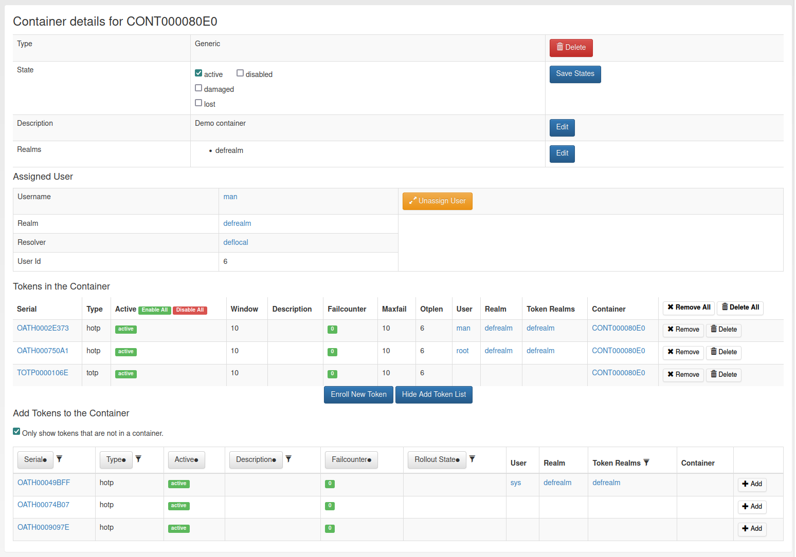

   *Add tokens to the container on the container details page*

Container Create
~~~~~~~~~~~~~~~~

To create a new container, first of all a type has to be selected. Below the drop-down menu, all token types that are
supported by the container type are displayed. For more information on the different container types, see
:ref:`container_types`. Additionally, you can set a description and assign the container to a user. From version 3.11,
you can also assign the container only to a realm.

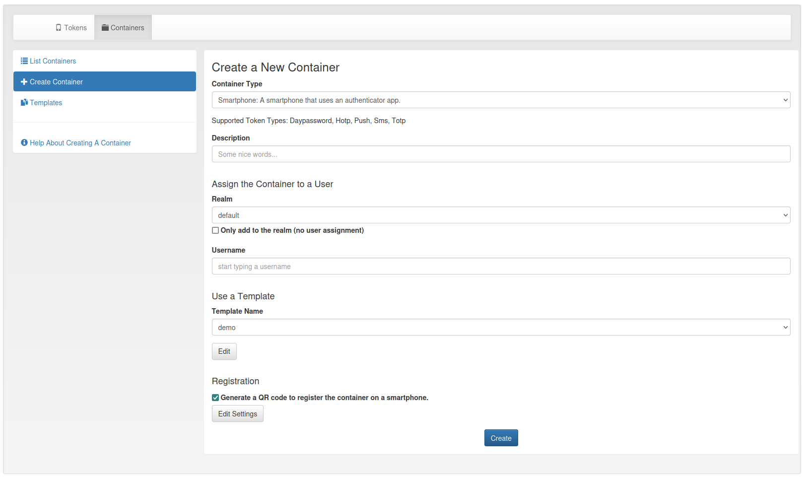

   *Container Create*

For a simplified rollout, the container can be created from a template. This will enroll predefined tokens in the
container. It is also possible to modify the template in place for the container. Note that the changes are only
applied to this container and do not change the template itself. The container will not be linked to the template.

After creating the container with a template, a dialog shows the enrollment information for each token.
For HOTP tokens, for example, the QR code to enroll the token on a smartphone is displayed.

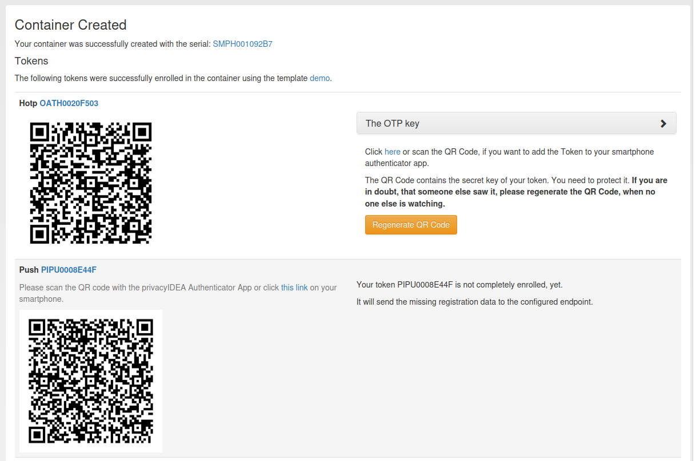

   *Container Created With a Template*

For smartphone containers, there is an additional option on the create page to register the container on a smartphone.
The registration can be secured with a passphrase. To do this, a prompt that is displayed to the user in the app, and
the actual passphrase response must be set. After creating the container, a dialog shows the registration QR code. The
button next to *Create Container* (*Reopen enrollment dialog*) opens it again. Scan the QR code with the privacyIDEA
authenticator app to finalize the registration.

If you create a smartphone container including the registration and also use a template, only the registration QR code
and no enrollment information will be displayed. It is not required to enroll the tokens on the smartphone individually.
After a successful registration, the tokens are automatically added during synchronization.

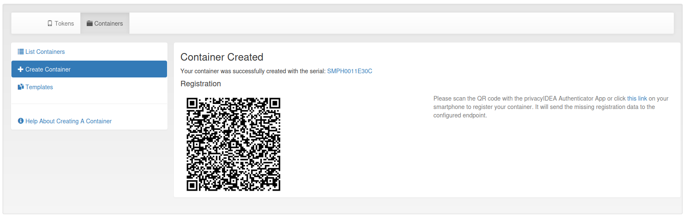

   *Container Created With Registration*

On the user details page, *Create New Container* opens this page with the user preselected. In the previous WebUI, a
basic container creation, which allows defining the container type, setting a description, and assigning the token
owner to the container, is also possible on the token details page and during the enrollment of a new token.

Templates
~~~~~~~~~

Templates are used to enroll predefined tokens in a container. The templates menu consists of three parts: Template
list, template details, and create template.

Template List
.............

The template list displays the name and the container type of each template. Clicking on the template name opens the
template details page.

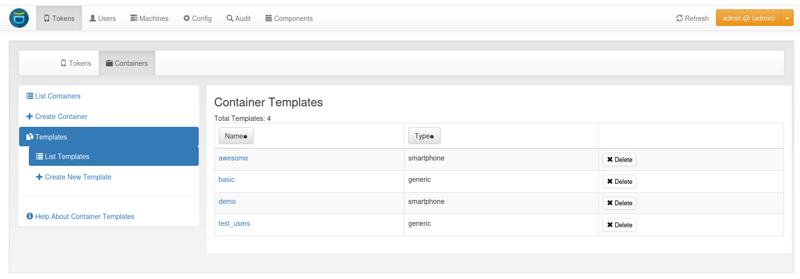

   *Container Template List*

Template Details
................

At the top of the page, the name and the container type are displayed. The checkbox *Set as default template* uses
the template as the default for creating new containers.
For each container type, one template can be the default. Setting a template as default will remove the default setting
from the previous default template.

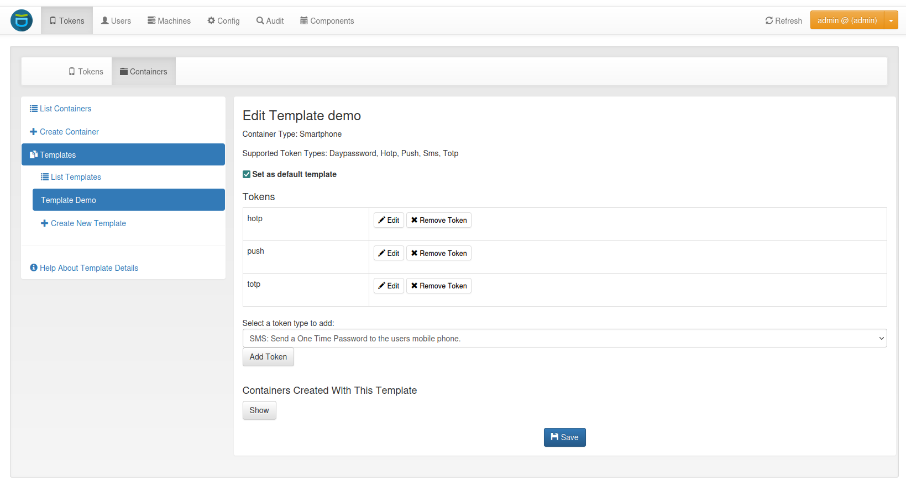

   *Container Template Details*

**Tokens**

In this section, all tokens of the template are listed. Expanding a token opens a section to change the
token type specific enroll options. The checkbox *Assign to user* assigns the token to the user of the container.
It is only relevant for admins. Users are always assigned to the tokens they enroll. A token is removed from the
template with its delete button; the change is stored when the template is saved.

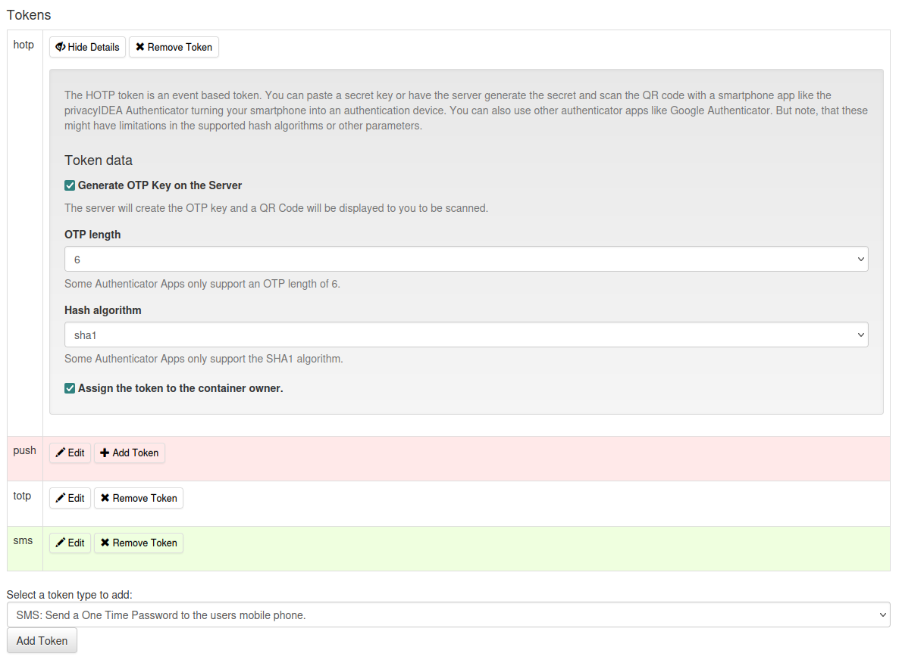

   *Token Settings for a Container Template*

New tokens are added to the template by clicking their token type under *Tokens*. They are finally added
after saving the template.

**Containers Created With This Template**

.. note:: This applies to the previous WebUI only, which is served when ``pi.cfg`` selects it as described in
   :ref:`legacy_webui`. In the WebUI, a container is compared to its template on the container details page.

Optionally, a table of all containers created from the template can be displayed. Additionally, clicking the
button *Compare* adds a new column to the table showing the differences for the token types between the containers
and the template. The row *missing* lists the token types included in the template but not in the container.
The row *additional* lists the token types included in the container but not in the template.

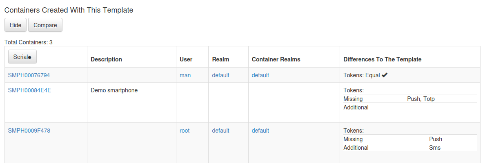

   *Comparison of the Template to the Containers Created with this Template*

Template Create
................

To create a new template, a unique name must be specified. If an existing name is entered, a warning will appear and
creation will be disabled. Additionally, the container type has to be selected. All token types supported for
templates of the container type are then offered under *Tokens*.

With *Set as default template*, the template can be selected as the default for this container type. For each
container type, one template can be the default. Setting the template as default removes the default setting of the
previous default template.

Finally, the tokens have to be added to the template. Expanding a token opens a section
where you can change the enroll options for the token. Check *Assign to user* to assign the token to the user of the
container.

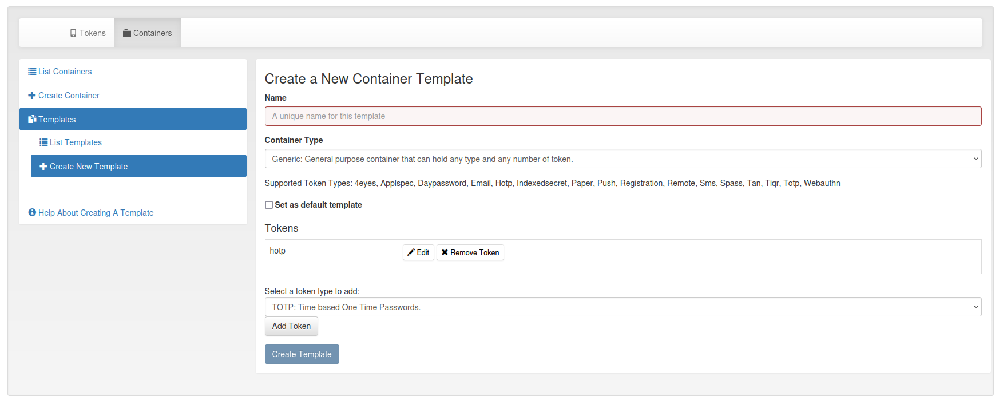

   *Create a Container Template*
