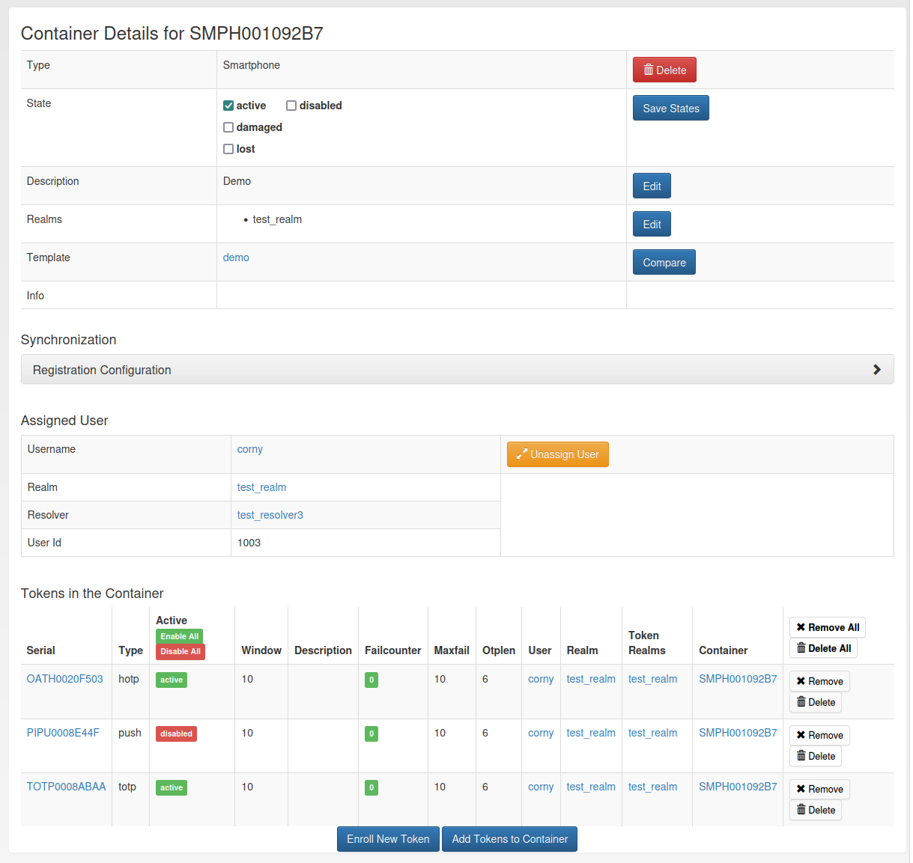

.. _container_view:

Functionality of the Container View
-----------------------------------

A container can be assigned to several realms. This is important if you have administrators for different realms.
A realm administrator is only allowed to see containers within his realms. He will not see containers, that are not in
his realm. So you can assign a container to realm A and realm B, thus the administrator A and the administrator B will
be able to see the container.

The container view submenu contains three parts: Container list, container details and create container.

Container List
~~~~~~~~~~~~~~

.. figure:: images/container_list.png
   :width: 500

   *Container List*

The container list shows all containers the user or administrator is allowed to see. To display all tokens contained in
the container, you can click on the plus in front of the container serial. By clicking on the container serial the
container details page opens.

Container Details
~~~~~~~~~~~~~~~~~
On the details page, all container attributes are displayed. The administrator and privileged users can perform
different actions on the container and the contained tokens.

   *Container Details*

Delete
------
By clicking on the delete button, two options appear: Deleting only the container or deleting the container with all
contained tokens.

States
------

A container can be in multiple states. However, there are also states that excludes each other, e.g. active and
disabled. Exclusive states are displayed next to each other.

Realms
------

A container can be in multiple realms even without having a specific user assigned. If a user is assigned, the container
is automatically in the realm of the user. This realm can not be removed without unassigning the user.

User
----

To assign a user the realm and user name have to be selected. Clicking on the assigned users name, redirects to the
users detail page.

Tokens
------

On the bottom of the container details page, all contained tokens are listed. You can enable and disable each token and
reset the fail counter. Additionally, the tokens can be removed from the container or deleted. If a token from another
user is in the container, the user will only see the serial and all token actions are disabled.

There are two options to add tokens to the container. First, a new token can be enrolled. The user is redirected to the
enroll page where the user of the container and the container are preselected. The second option is to add an existing
token. Clicking on the button 'Add Tokens to Container' opens a token table with all tokens the administrator or user is
allowed to see. Per default only tokens that are not yet in a container are displayed. Deselecting this option displays
all tokens. Adding a token which is already in a container to another container removes it from the old container. The
token list can be filtered and sorted by the different token attributes.

.. figure:: images/container_details_add_tokens.png
   :width: 500

   *Add tokens to the container on the container details page*

Container Create
~~~~~~~~~~~~~~~~

.. figure:: images/container_create.png
   :width: 500

   *Container Create*

To create a new container, first of all a type has to be selected. Below the drop-down menu, all token types that are
selected by the container type are displayed. Additionally, you can set a description and assign the container to a
user.

You can also create a container an the token details page, during the enrollment of a new token and on the user details
page.
