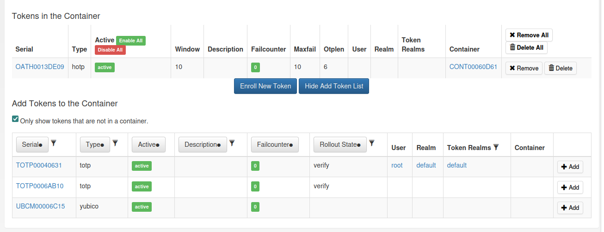
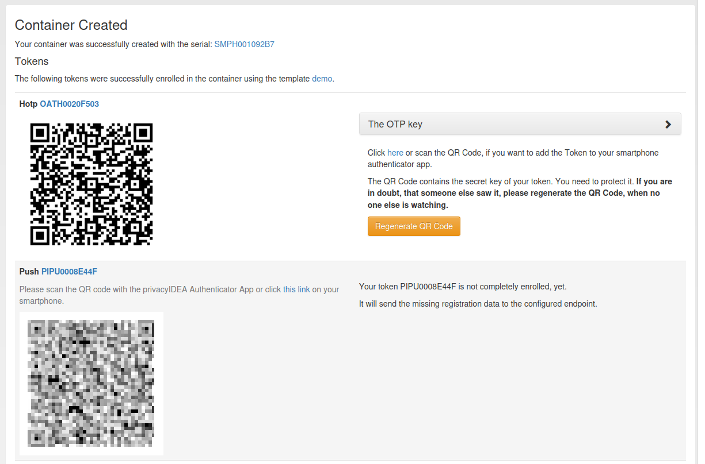
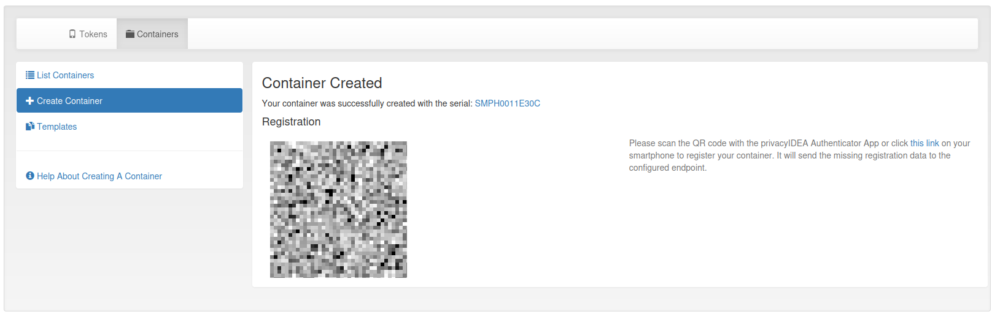

.. _container_functionality:

Functionality of the Container View
-----------------------------------

Administrators can see and edit all containers of the realms they are allowed to manage. A container can be in several
realms. This enables the possibility that administrators of different realms can manage the same container.
Users can only see and edit their own containers.

The container view submenu contains four parts: Container list, container details, create container and templates.

Container List
~~~~~~~~~~~~~~

.. figure:: images/container_list.png
   :width: 500

   *Container List*

The container list displays all containers that the user or administrator is allowed to see. To view all the tokens
contained in a container, click on the plus sign in front of the container serial number. Clicking on the container
serial will open the container details page.

Container Details
~~~~~~~~~~~~~~~~~

The container details page displays all container attributes. The administrator and privileged users can perform
different actions on the container and the contained tokens.

.. figure:: images/container_details.png
   :width: 500

   *Container Details*

Delete
......

By clicking on the delete button, two options appear: Deleting only the container or deleting the container with all
contained tokens.

States
......

A container can be in multiple states. However, there are also states that exclude each other, e.g. active and
disabled. Exclusive states are displayed next to each other.

Realms
......

A container can be in multiple realms even without having a specific user assigned. If a user is assigned, the container
is automatically in the realm of the user. This realm can not be removed without unassigning the user.

User
....

To assign a user, select a realm and start typing the users name. Select one of the suggested users and assign it to the
container by clicking on the `Assign User` button. Clicking on the assigned users name, redirects to the
:ref:`user_details` page.

Template
........

If the container was created from a template, the template name is displayed. Clicking on the template name opens the
template details page.

Additionally, the container can be compared to the template. This is useful if the template was changed after the
container was created. Clicking the `Compare` button will show a table with the differences. The row `missing`
lists the token types contained in the template but not in the container. The row `additional` lists the token
types included in the container but not in the template.

Synchronization
...............

Beginning from version 3.11, smartphones can be synchronized with the container on the privacyIDEA server. To enable
the synchronization, registration is required first.
The registration can be initiated in the dropdown `Registration Configuration`.
Optionally, the user can secure the registration with a passphrase. For this, a prompt that will be displayed to the
user in the authenticator app, and the correct passphrase response can be configured. After clicking the button
`Register Container on Device`, a QR code is displayed. The user has to scan this QR code with the privacyIDEA
Authenticator app to complete the registration.

.. note:: It is required to configure a container policy specifying at least the :ref:`container_policy_server_url`
    action. See :ref:`container_policies` for more information.

   *Synchronization Section on the Container Details Page*

If the smartphone is successfully registered, the `registration_state` in the container info changes from `client_wait`
to `registered`. In case the QR code gets lost or the passphrase needs to be changed, the QR code can be regenerated
in the dropdown `Registration Configuration`. However, this is only possible while the registration is in the
`client_wait` state.

For registered containers, the time of the last synchronization and the last time a token from the container
was used for a successful authentication are displayed. Note that these timestamps are only set for registered
containers, hence the last authentication time stamp is not set yet for a newly registered container.

If the container with all tokens shall be registered on a new smartphone, a rollover can be performed. Similar to
the registration, you can set a passphrase in the dropdown `Registration Configuration` and generate a new QR code
by clicking on the `Rollover` button. The user has to scan the QR code with the new smartphone. If the new smartphone
has been registered successfully, the old smartphone can no longer be synchronized. The rollover generates new secrets
for all tokens in the container. This invalidates all tokens on the old smartphone.
During the rollover, the `registration_state` changes from `registered` to `rollover`. After a successful rollover and
a first synchronization with the new device, it changes back to `registered`.

The container can always be unregistered by clicking the `Unregister` button. The smartphone can not be synchronized
with the server anymore. A window will appear asking if you want to disable all tokens. The window disappears
automatically after a few seconds.

.. note:: Not all synchronization features work for offline tokens. See :ref:`synchronization` for more information.

Tokens
......

At the bottom of the container details page, all the tokens in the container are listed. You can enable and disable each
token and reset the failure counter. You can also remove or delete tokens from the container.
If another user's token is in the container, the user will only see the serial and all token actions will be disabled.

There are two ways to add tokens to the container. Firstly, a new token can be enrolled. The user will be redirected to
the enrollment page where the user of the container and the container are pre-selected. The second option is to add an
existing token. Clicking on the `Add Tokens to Container` button will open a token table with all the tokens that the
administrator or user is allowed to see. By default, only tokens that are not yet in a container are displayed.
Deselecting this option displays all tokens. Adding a token that is already in a container to another container removes
it from the previous container. The token list can be filtered and sorted by various token attributes.

   *Add tokens to the container on the container details page*

Container Create
~~~~~~~~~~~~~~~~

To create a new container, first of all a type has to be selected. Below the drop-down menu, all token types that are
supported by the container type are displayed. Additionally, you can set a description and assign the container to a
user. From version 3.11, you can also assign the container only to a realm.

.. figure:: images/container_create.png
   :width: 500

   *Container Create*

For a simplified rollout, the container can be created from a template. This will enroll predefined tokens in the
container. It is also possible to modify the template in place for the container. Note that the changes are only
applied to this container and do not change the template itself. The container will not be linked to the template.

After creating the container with a template, a new page opens which shows the enrollment information for each token.
For HOTP tokens, for example, the QR code to enroll the token on a smartphone is displayed.

   *Container Created With a Template*

For smartphone containers, there is an additional option on the create page to register the container on a smartphone.
The registration can be secured with a passphrase. To do this, a prompt that is displayed to the user in the app, and
the actual passphrase response must be set. After creating the container, a new page will open showing the registration
QR code. Scan the QR code with the privacyIDEA authenticator app to finalize the registration.

If you create a smartphone container including the registration and also use a template, only the registration QR code
and no enrollment information will be displayed. It is not required to enroll the tokens on the smartphone individually.
After a successful registration, the tokens are automatically added during synchronization.

   *Container Created With Registration*

You can also create a container on the token details page, during the enrollment of a new token, and on the user details
page. However, there is only a basic container creation possible, which allows to define the container type, set a
description, and assign the token owner to the container.

Templates
~~~~~~~~~

Templates are used to enroll predefined tokens in a container. The templates menu consists of three parts: Template
list, template details, and create template.

Template List
.............

The template list displays the name and the container type of each template. Clicking on the template name opens the
template details page.

   *Container Template List*

Template Details
................

At the top of the page, the name, the container type, and the token types that can be added to this template are
displayed. Below is a checkbox to use the template as the default for creating new containers.
For each container type, one template can be the default. Setting a template as default will remove the default setting
from the previous default template.

   *Container Template Details*

**Tokens**

In this section, a table shows all tokens of the template. Clicking on the `Edit` button opens a section to change the
token type specific enroll options. At the bottom is a checkbox to assign the token to the user of the container.
This option is checked by default. It is only relevant for admins. Users are always assigned to the tokens they
enroll. Removing a token from the template will first highlight the token in red and finally remove if after saving
the template.

   *Token Settings for a Container Template*

Below the token table, new tokens can be added to the template. The token type can be selected from a drop-down menu.
New tokens are highlighted in green in the token table and are finally added after saving the template. Newly added
tokens are removed immediately from the table without highlighting them in red because they are not saved yet.

**Containers Created With This Template**

Optionally, a table of all containers created from the template can be displayed. Additionally, clicking the
button `Compare` adds a new column to the table showing the differences for the token types between the containers
and the template. The row `missing` lists the token types included in the template but not in the container.
The row `additional` lists the token types included in the container but not in the template.

   *Comparison of the Template to the Containers Created with this Template*

Template Create
................

To create a new template, a unique name must be specified. If an existing name is entered, a warning will appear and
creation will be disabled. Additionally, the container type has to be selected. Below the drop-down menu, all token
types supported for templates of the container type are displayed.

The template can be selected as the default for this container type. For each container type, one template can be the
default. Setting the template as default removes the default setting of the previous default template.

Finally, the tokens have to be added to the template. Clicking on the `Edit` button behind the token opens a section
where you can change the enroll options for the token. By default, the token will be assigned to the user of the
container. This can be disabled at the bottom of the section.

   *Create a Container Template*
