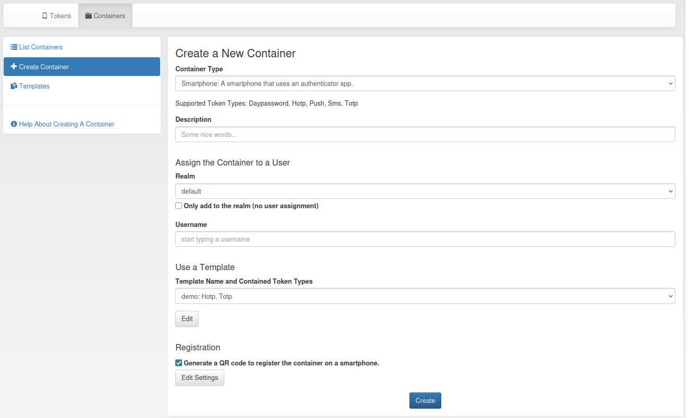

.. _container_functionality:

Functionality of the Container View
-----------------------------------

Administrators can see and edit all containers of the realms they are allowed to manage. A container can be in several
realms. This enables the possibility that administrators of different realms can manage the same container.
Users can only see and edit their own containers.

The container view submenu contains three parts: Container list, container details and create container.

Container List
~~~~~~~~~~~~~~

   *Container List*

The container list displays all containers that the user or administrator is allowed to see. To view all the tokens
contained in a container, click on the plus sign in front of the container serial number. Clicking on the container
serial will open the container details page opens.

Container Details
~~~~~~~~~~~~~~~~~

The container details page displays all container attributes. The administrator and privileged users can perform
different actions on the container and the contained tokens.

.. figure:: images/container_details.png
   :width: 500

   *Container Details*

Delete
......
By clicking on the delete button, two options appear: Deleting only the container or deleting the container with all
contained tokens.

States
......

A container can be in multiple states. However, there are also states that exclude each other, e.g. active and
disabled. Exclusive states are displayed next to each other.

Realms
......

A container can be in multiple realms even without having a specific user assigned. If a user is assigned, the container
is automatically in the realm of the user. This realm can not be removed without unassigning the user.

User
....

To assign a user, select a realm and start typing the users name. Select one of the suggested users and assign it to the
container by clicking on the 'Assign User' button. Clicking on the assigned users name, redirects to the
:ref:'user_details' page.

Tokens
......

At the bottom of the container details page, all the tokens in the container are listed. You can enable and disable each
token and reset the failure counter. You can also remove or delete tokens from the container.
If another user's token is in the container, the user will only see the serial and all token actions will be disabled.

There are two ways to add tokens to the container. Firstly, a new token can be enrolled. The user will be redirected to
the enrollment page where the user of the container and the container are pre-selected. The second option is to add an
existing token. Clicking on the 'Add Tokens to Container' button will open a token table with all the tokens that the
administrator or user is allowed to see. By default, only tokens that are not yet in a container are displayed.
Deselecting this option displays all tokens. Adding a token that is already in a container to another container removes
it from the previous container. The token list can be filtered and sorted by various token attributes.

.. figure:: images/container_details_add_tokens.png
   :width: 500

   *Add tokens to the container on the container details page*

Container Create
~~~~~~~~~~~~~~~~

To create a new container, first of all a type has to be selected. Below the drop-down menu, all token types that are
supported by the container type are displayed. Additionally, you can set a description and assign the container to a
user.

   *Container Create*

You can also create a container on the token details page, during the enrollment of a new token, and on the user details
page.
