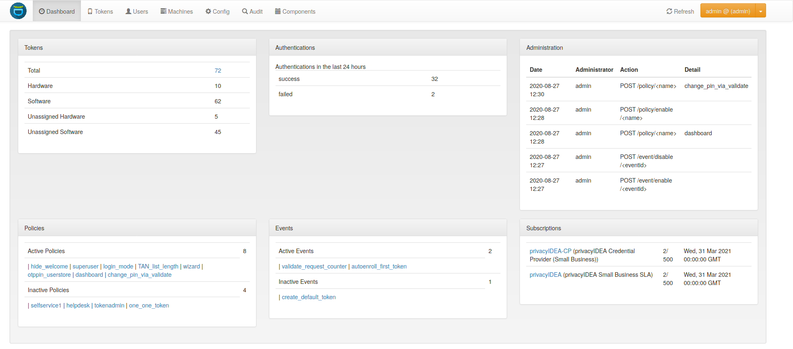
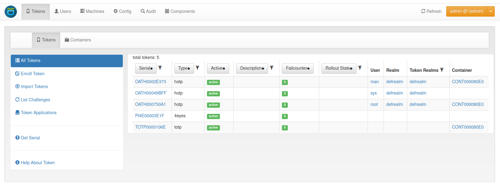
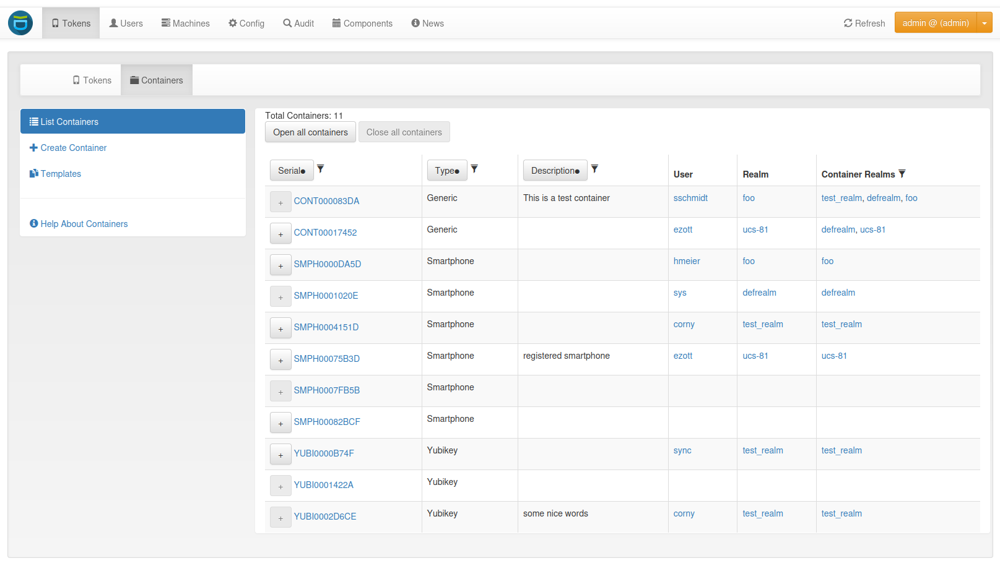
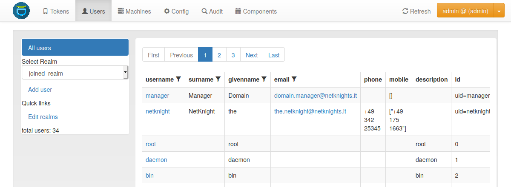
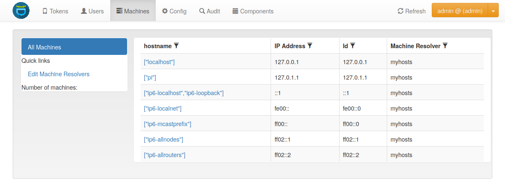
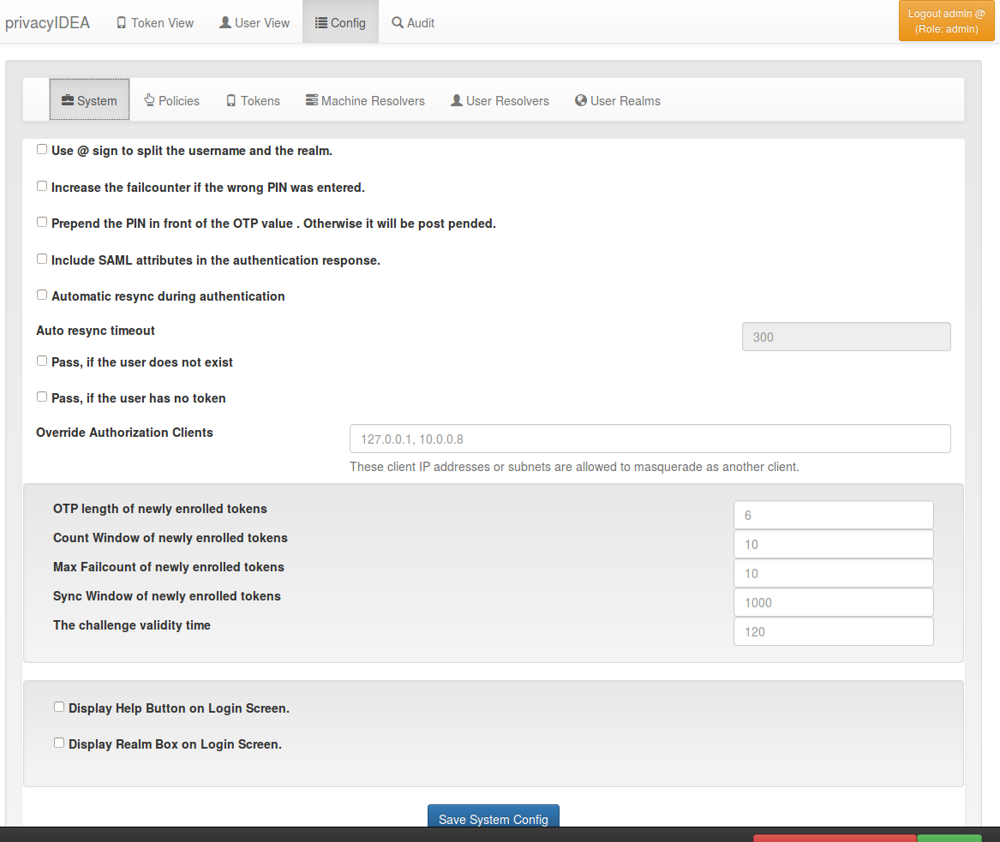
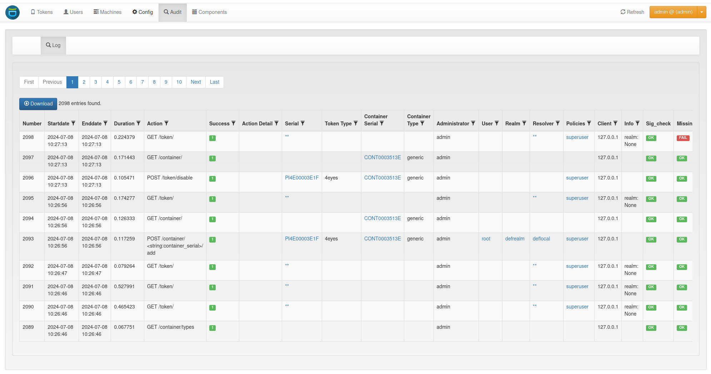
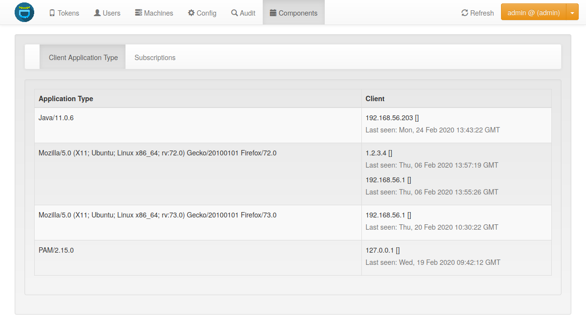

.. _webui:

WebUI
=====

.. index:: ! webui, ! WebUI

privacyIDEA comes with a web-based user interface which is used to manage and configure
the privacyIDEA server. It is also used a self-service portal for the average user, who
manages his own tokens. This section gives an overview on the interface and links the
respective sections in the documentation.

.. _new_webui:

New WebUI
---------
.. index:: new webui
.. versionadded:: 3.12

To enable the new WebUI, edit the configuration file `pi.cfg` and add the following lines::

    PI_STATIC_FOLDER = "static_new/"
    PI_TEMPLATE_FOLDER = "static_new/dist/privacyidea-webui/browser/"

.. _dashboard:

Dashboard
---------

.. index:: dashboard

Starting with version 3.4, privacyIDEA includes a basic dashboard, which can be enabled
by the WebUI policy :ref:`webui_admin_dashboard`. The dashboard will be displayed as a starting page
for administrators and contains information about token numbers, authentication requests,
recent administrative changes, policies, event handlers and subscriptions. It uses the usual
endpoints to fetch the information, so only information to which an administrator has read
access is displayed in the dashboard.

Certificate health
~~~~~~~~~~~~~~~~~~

.. index:: certificate health, certificate expiry

The dashboard also shows a *Certificates* panel listing TLS certificates that are
relevant to the running privacyIDEA instance:

* The certificate of every configured LDAP resolver that uses ``ldaps://`` or
  ``START_TLS``. Each entry links to the corresponding resolver detail page.
* Optionally, the privacyIDEA server certificate. Two opt-in sources can be
  configured in ``pi.cfg``; both are off by default.

To check the privacyIDEA server certificate, set one or both of:

* ``PI_SERVER_CERT_FILE`` - absolute path to a PEM (or DER) certificate file
  on disk that the privacyIDEA process can read. Useful when the same
  process serves TLS, or when an operator has shared the reverse-proxy's
  cert with the privacyIDEA user::

    PI_SERVER_CERT_FILE = "/etc/letsencrypt/live/auth.example.com/fullchain.pem"

* ``PI_HEALTH_CERT_PROBES`` - list of ``{"host": "...", "port": int}``
  endpoints that privacyIDEA opens a TLS connection to and reads the served
  certificate from. Targets must be reachable from the privacyIDEA process.
  Typical values:

  * **Apache + uwsgi (Ubuntu deb package):** ``[{"host": "127.0.0.1", "port": 443}]``
    - probes Apache over loopback and reads the cert it actually serves.
  * **Docker (nginx + gunicorn):** ``[{"host": "nginx", "port": 443}]`` or
    whatever the docker-compose service name resolves to inside the network.

  A single probe target may also be given as a bare dict
  (``{"host": "...", "port": ...}``) instead of a one-element list.

  Both keys are admin-controlled: probe targets are **never** derived from
  request headers, to keep the endpoint from being usable as an SSRF primitive.

Each row is classified by remaining validity and color-coded:

* ``ok`` (green): more than 30 days remaining.
* ``warning`` (yellow): 30 days or less remaining.
* ``critical`` (red): 7 days or less remaining.
* ``expired`` (red): the certificate has already expired.
* ``error`` (yellow): the probe failed (file not readable, timeout,
  connection refused, ...).

The probe results are cached for ``PI_CERT_CHECK_CACHE_SECONDS`` seconds
(default ``3600``). The cache is invalidated automatically when an admin
saves or deletes a resolver, and can be bypassed manually via the refresh
button on the panel. Hit the panel data via ``GET /system/health/certificates``;
add ``?refresh=1`` to skip the cache.

Resolver timing
~~~~~~~~~~~~~~~

.. index:: resolver timing, dashboard metrics

The dashboard also shows a *Resolver Timing* panel that summarises the
latency of every public ``UserIdResolver`` operation - ``checkPass``,
``getUserList``, ``getUserId``, and so on - across LDAP, SQL, HTTP-based
(EntraID, Keycloak), and passwd resolvers. One row per resolver, sorted
worst p95 first. The columns ``Avg`` / ``p95`` / ``Max`` are color-coded
green below ``100 ms``, yellow below ``500 ms``, and red above. p95 is
suppressed (``-``) for resolvers with fewer than 20 samples in the
window, where bucket-bound rounding would not be meaningful.

p95 readings are approximated from prom-style cumulative histogram
buckets and so always round up to the next bucket boundary. The active
bucket boundaries are ``50 ms``, ``100 ms``, ``150 ms``, ``200 ms``,
``250 ms``, ``500 ms``, ``1 s``, ``2 s``, ``5 s``; anything above ``5 s``
is reported in the ``+inf`` tail. The same boundaries are listed in the
panel's tooltip.

The data is read from ``GET /system/health/resolver_timing`` (default
window ``since_seconds=3600``) and aggregates across all privacyIDEA
nodes.

Notification delivery
~~~~~~~~~~~~~~~~~~~~~

.. index:: notification delivery, dashboard metrics

The *Notification Delivery* panel summarises outbound message delivery
across the three notification channels:

* **Push** - per Firebase provider.
* **SMS** - per configured SMS gateway identifier (HTTP, SMPP, Sipgate,
  SMTP-to-SMS, script).
* **Email** - per configured SMTP server identifier.

Each row shows the OK count, the failed count (transient send-failures
plus exceptions), and the p95 send duration. The failed cell is
color-coded green below 1%, yellow below 5%, and red above 5%, computed
against the channel row's total. Reads ``GET
/system/health/notification_delivery`` (default ``since_seconds=3600``).

.. note::

   When the SMTP job queue is enabled (``enqueue_job=True`` on the SMTP
   configuration), the email metric records dispatch success rather than
   final delivery: the synchronous return value is ``True`` once the
   job has been queued, regardless of what the worker eventually does.

Storage and cleanup
~~~~~~~~~~~~~~~~~~~

.. index:: MetricsCleanup, metric_aggregate

The Resolver Timing and Notification Delivery panels both read from a
single pre-aggregated table (``metric_aggregate``). Each row holds a
counter or histogram for a 5-minute window, partitioned by the writing
node, so per-request overhead stays low.

The table grows unbounded unless an operator schedules the
``MetricsCleanup`` periodic task under *Config -> Tasks*. The task takes
one option, ``older_than_hours`` (default ``24``); a daily schedule is
recommended, which keeps the table at roughly two days' worth of rows.
Each run is a single indexed ``DELETE``, so cost is negligible. Skip the
task entirely and the table will keep all metric rows indefinitely.

If you need to turn the whole feature off, set ``PI_NO_INTERNAL_METRICS = True``
in ``pi.cfg``. With that flag every ``observe`` / ``inc`` call short-circuits
before touching the database; the dashboard panels will simply show no data.
Reads remain available, and the ``MetricsCleanup`` task continues to work.

.. _news:

News
----

.. index:: News, RSS

privacyIDEA allows to fetch news via RSS feeds. This is supposed to help the administrator to keep up with information
in regards to running your privacyIDEA. Per default privacyIDEA fetches news from privacyidea.org, netknights.it and
community.privacyidea.org.

News can be displayed to the administrators and to normal users!

You can use the policy :ref:`policy_rss_age` to define the age of the messages to fetch and the policy
:ref:`policy_rss_feeds` to define the feeds to fetch. This way you can even provide your own feeds to your end users.

Note that setting the `rss_age` to 0 will disable the News tab.

.. _tokensview:

Tokens
------

.. index:: tokensview

The administrator can see all the tokens of all realms he is allowed to manage in the
tokenview. Each token can be located in several realms and be assigned to one
user. The administrator can see all the details of the token.

   *Tokens overview*

The administrator can click on one token, to show more details of this token
and to perform actions on this token. Read on here:

   :ref:`token_details`

In the *Token Applications* the administrator can check for all SSH Keys attached to
services and for HOTP tokens attached to machines for offline authentication.
Also see :ref:`machines`.

.. _container_view:

Containers
----------

.. index:: containerview

In the container view, administrators can see all the containers in all the realms they are allowed to manage. User can
only see their own containers. Each container can hold multiple tokens. A container can be in multiple realms, but can
only be assigned to one user. You can click on a container to see more details and perform actions on the container and
the tokens it contains.

   *Container List*

More details about the container view can be found here:

.. toctree::
   :maxdepth: 1

   container_view

.. _usersview:

Users
-----

The administrator can see all users fetched by :ref:`useridresolvers` located in
:ref:`realms` he is allowed to manage.

.. note:: Users are only visible, if the useridresolver is located
   within a realm. If you only define a useridresolver but no realm,
   you will not be able to see the users!

You can select one of the realms in the left drop down box. The administrator
will only see the realms in the drop down box, that he is allowed to manage.

   *The Users view list all users in a realm.*

The list shows the users from the select realm. The username, surname,
given name, email and phone are filled according to the definition of
the useridresolver.

Even if a realm contains several useridresolvers, users from all
resolvers within this realm are displayed. However, if a user with the
same login name exists in more than one resolver, only the user from the
highest-priority resolver is shown. See :ref:`resolver_priority` for details.

Read about the functionality of the users view in the following sections.

.. toctree::
   :maxdepth: 1

   user_details
   manage_users
   user_attributes

.. _webui_machines:

Machines
--------

In this view Machines are listed which are fetched by the configured machine resolvers.
Machines are only necessary if you plan :ref:`special use cases<machines>` like
managing SSH keys or doing offline OTP. In most cases there is no need to manage machines and this view is empty.

   *The Machines view.*

.. _config:

Config
------

The configuration tab is the heart of the privacyIDEA server. It contains the general
:ref:`system_config`, allows configuring :ref:`policies` which are important to configure
behavior of the system, manages the :ref:`eventhandler` and lets the user set up :ref:`periodic_tasks`.

   *The Config section is the heart of the privacyIDEA server.*

.. _webui_audit:

Audit
-----

In this tab, the :ref:`audit` log is displayed which lists all events the server registers.

   *Events can be displayed in the Audit log.*

.. _components:

Components
----------

.. index:: Components

Starting with privacyIDEA 2.15 you can see privacyIDEA components in the Web UI.
privacyIDEA collects authenticating clients with their User Agent. Usually
this is a type like *PAM*, *FreeRADIUS*, *Wordpress*, *OwnCloud*, ...
For more information, you may read on :ref:`application_plugins`.
This overview helps you to understand your network and keep track which clients
are connected to your network.

   *The Components display client applications and subscriptions*

Subscriptions, e.g. with `NetKnights <https://netknights.it/en/>`_, the
company behind privacyIDEA, can also be viewed and managed in this tab.
