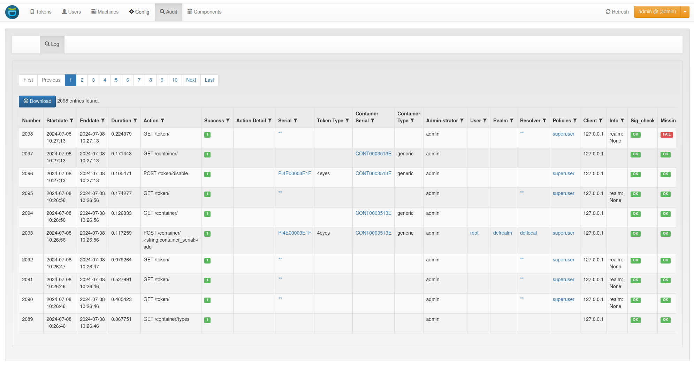

.. _webui:

WebUI
=====

.. index:: ! webui, ! WebUI

privacyIDEA comes with a web-based user interface which is used to manage and configure
the privacyIDEA server. It is also used a self-service portal for the average user, who
manages his own tokens. This section gives an overview on the interface and links the
respective sections in the documentation.

.. _dashboard:

Dashboard
---------

.. index:: dashboard

Starting with version 3.4, privacyIDEA includes a basic dashboard, which can be enabled
by the WebUI policy :ref:`webui_admin_dashboard`. The dashboard will be displayed as a starting page
for administrators and contains information about token numbers, authentication requests,
recent administrative changes, policies, event handlers and subscriptions. It uses the usual
endpoints to fetch the information, so only information to which an administrator has read
access is displayed in the dashboard.

.. figure:: images/dashboard.png
   :width: 500

.. _news:

News
----

.. index:: News, RSS

privacyIDEA allows to fetch news via RSS feeds. This is supposed to help the administrator to keep up with information
in regards to running your privacyIDEA. Per default privacyIDEA fetches news from privacyidea.org, netknights.it and
community.privacyidea.org.

News can be displayed to the administrators and to normal users!

You can use the policy :ref:`policy_rss_age` to define the age of the messages to fetch and the policy
:ref:`policy_rss_feeds` to define the feeds to fetch. This way you can even provide your own feeds to your end users.

Note that setting the `rss_age` to 0 will disable the News tab.

.. _tokensview:

Tokens
------

.. index:: tokensview

The administrator can see all the tokens of all realms he is allowed to manage in the
tokenview. Each token can be located in several realms and be assigned to one
user. The administrator can see all the details of the token.

   *Tokens overview*

The administrator can click on one token, to show more details of this token
and to perform actions on this token. Read on here:

.. toctree::
   :maxdepth: 1

   token_details

In the *Token Applications* the administrator can check for all SSH Keys attached to
services and for HOTP tokens attached to machines for offline authentication.
Also see :ref:`machines`.

.. _container_view:

Containers
----------

.. index:: containerview

In the container view, administrators can see all the containers in all the realms they are allowed to manage. User can
only see their own containers. Each container can hold multiple tokens. A container can be in multiple realms, but can
only be assigned to one user. You can click on a container to see more details and perform actions on the container and
the tokens it contains.

.. figure:: images/container_list.png
   :width: 500

   *Container List*

More details about the container view can be found here:

.. toctree::
   :maxdepth: 1

   container_view

.. _usersview:

Users
-----

The administrator can see all users fetched by :ref:`useridresolvers` located in
:ref:`realms` he is allowed to manage.

.. note:: Users are only visible, if the useridresolver is located
   within a realm. If you only define a useridresolver but no realm,
   you will not be able to see the users!

You can select one of the realms in the left drop down box. The administrator
will only see the realms in the drop down box, that he is allowed to manage.

.. figure:: images/usersview.png
   :width: 500

   *The Users view list all users in a realm.*

The list shows the users from the select realm. The username, surname,
given name, email and phone are filled according to the definition of
the useridresolver.

Even if a realm contains several useridresolvers all users from all
resolvers within this realm are displayed.

Read about the functionality of the users view in the following sections.

.. toctree::
   :maxdepth: 1

   user_details
   manage_users
   user_attributes

.. _machines:

Machines
--------

In this view :ref:`machines` are listed which are fetched by the configured machine resolvers.
Machines are only necessary if you plan special use cases like managing SSH keys or doing offline OTP.
In most cases there is no need to manage machines and this view is empty.

.. figure:: images/machinesview.png
   :width: 500

   *The Machines view.*

.. _config:

Config
------

The configuration tab is the heart of the privacyIDEA server. It contains the general
:ref:`system_config`, allows configuring :ref:`policies` which are important to configure
behavior of the system, manages the :ref:`eventhandler` and lets the user set up :ref:`periodic_tasks`.

.. figure:: ../configuration/images/system-config.png
   :width: 500

   *The Config section is the heart of the privacyIDEA server.*

.. _webui_audit:

Audit
-----

In this tab, the :ref:`audit` log is displayed which lists all events the server registers.

   *Events can be displayed in the Audit log.*

.. _components:

Components
----------

.. index:: Components

Starting with privacyIDEA 2.15 you can see privacyIDEA components in the Web UI.
privacyIDEA collects authenticating clients with their User Agent. Usually
this is a type like *PAM*, *FreeRADIUS*, *Wordpress*, *OwnCloud*, ...
For more information, you may read on :ref:`application_plugins`.
This overview helps you to understand your network and keep track which clients
are connected to your network.

.. figure:: images/componentsview.png
   :width: 500

   *The Components display client applications and subscriptions*

Subscriptions, e.g. with `NetKnights <https://netknights.it/en/>`_, the
company behind privacyIDEA, can also be viewed and managed in this tab.
