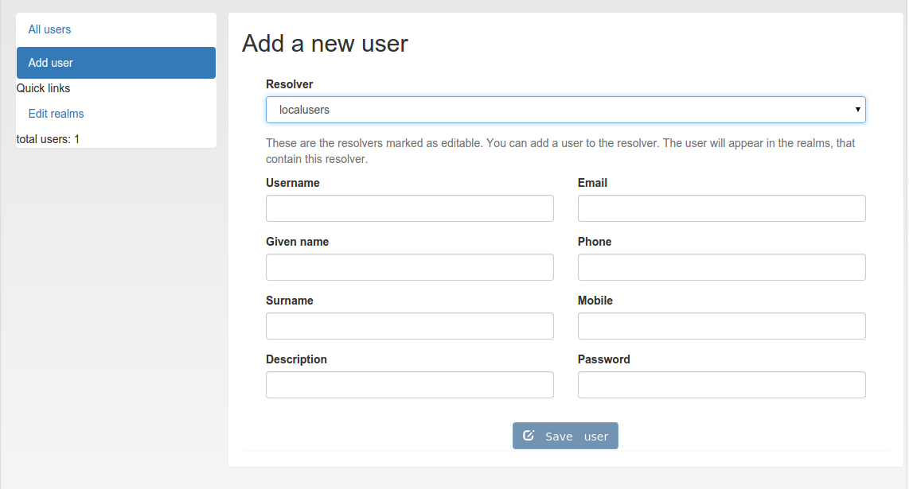

.. _manage_users:

Manage Users
------------

.. index:: Edit User, Change User Password, Add User

Since version 2.4 privacyIDEA allows you to edit users in the configured
resolvers. At the moment this is possible for SQL resolvers.

In the resolver definition you need to check the new checkbox **Edit user
store**.

.. figure:: images/edit_user_store.png
   :width: 500

   *Users in SQL can be edited, when checking the checkbox.*

In the Users Detail view, the administrator then can click the button "Edit"
and modify the user data and also set a new password.

.. figure:: images/user_edit.png
   :width: 500

   *Edit the attributes of an existing user.*

.. note:: The data of the user will be modified in the user store (database).
   Thus the users data, which will be returned by a resolver, is changed. If the
   resolver is contained in several realms these changes will reflect in all
   realms.

If you want to add a user, you can click on *Add User* in the *User View*.

   *Add a new user.*

Users are contained in resolvers and added to resolvers.
So you need to choose an existing
resolver and not a realm. The user will be visible in all realms, the
resolver is contained in.

.. note:: Of course you can set policies to allow or deny the administrator
   these rights.

.. _simple_local_user_setup:

Simple local users setup
........................

You can setup a local users definition quite easily. Run::

   pi-manage resolver create_internal test

This will create a database table "users_test" in your token database. And it
will create a resolver "test" that refers to this database table.

Then you can add this resolver to realm::

   pi-manage realm create internal_realm test

Which will create a realm "internal_realm" containing the resolver "test".
Now you can start adding users to this resolver as described above.

.. note:: This is an example of how to get started with users quite quickly.
   Of course you do not need to save the users table in the same database as
   the tokens. But in scenarios, where you do not have existing user stores or
   the user stores are managed by another department or are not accessible
   easily this may be sensible way.
