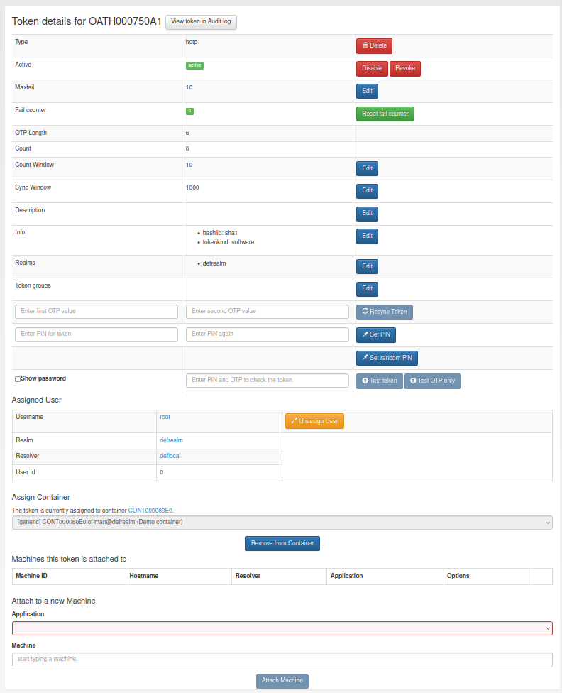
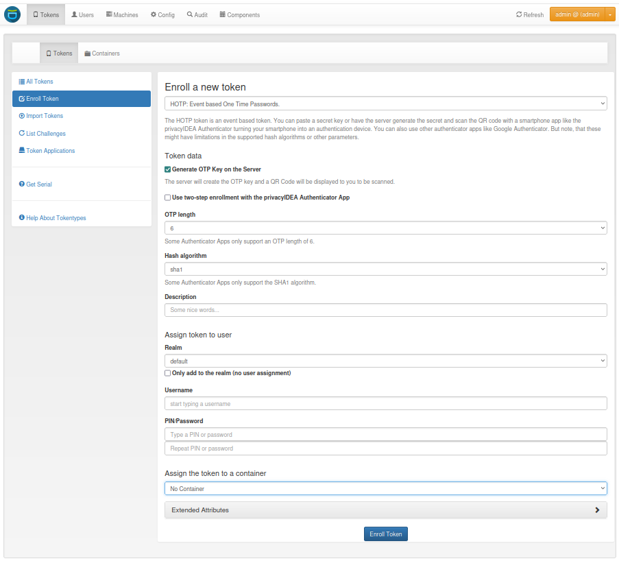

:orphan:

.. _token_details:

Functionality of the Tokens view
================================

Selecting a token from the list presents a detailed overview of the properties
of the token token and also let the administrator or a privileged user perform specific tasks for this token.

   *Token Detail*

Below the token attributes you see the assigned user. You can click on the username and
change to the :ref:`user_details`.

Under the user assignment, the token can be added to or removed from a container. Clicking on the container serial
redirects to the container details (:ref:`container_functionality`).

Lost token
----------

.. index:: Lost token

When a user has lost a token, the administrator or the user can create a
temporary password token for the user to login.

The administrator or a privileged helpdesk user with a :ref:`lost_token` policy
has to select the token that was lost and click the button ``Lost token``.
A new :ref:`pw_token` is generated.
The OTP PIN of the old token is automatically copied to the new token.
Thus the administrator does not know the OTP PIN, while the user can use his old PIN.

.. figure:: images/lost_token_button.png
   :width: 500

A long password is displayed to the administrator and the administrator
can read this password to the user. The user now can authenticate
with his old OTP PIN and the long password.

The lost token is deactivated.

.. _get_serial:

Get Serial
----------

.. index:: Get Serial (Determine Serial by OTP)

The administrator can enter a OTP value that was generated by an unknown token.
Then the serial number for the corresponding token is search and displayed.

.. note:: Since OTP values for all matching tokens need to be calculated,
    this can be time consuming!

.. _tokeninfo:

Token settings
---------------

.. index:: maxfail, failcount, token description, count window

You can change the following token settings.

**MaxFail and FailCount**

   If the login fail counter reaches the ``MaxFail`` the user can not login
   with this token anymore. The Failcounter ``FailCount`` has to be reset
   to zero.

**TokenDesc**

   The token description is also displayed in the tokenview. You can
   set a description to make it easier to identify a token. The token
   description will be truncated to fit into the database column (80 characters).

.. _countwindow:

**CountWindow**

   The ``CountWindow``  is the look ahead window of event based tokens.
   If the user pressed the button on an event based token the counter
   in the token is increased. If the user does not use this otp value
   to authenticate, the server does not know, that the counter in the
   token was increased.
   This way the counter in the token can get
   out of sync with the server.

.. index:: syncwindow, out of sync

**SyncWindow**

   If a token was out of sync (see ``CountWindow``), then it needs to
   be synchronized. This is done by entering two consecutive OTP values.
   The server searches these two values within the next ``CountWindow``
   (default 1000) values.

.. index:: OTP length

**OtpLen**

   This is the length of the OTP value that is generated by the token.
   The password that is entered by the user is split according to
   this length. 6 or 8 characters are split as OTP value and the
   rest is used as static password (OTP PIN). This value is set during
   token enrollment.

**Hashlib**

   The HOTP algorithm can be used with SHA1 or SHA256.

**Tokeninfo - Auth max**

   The administrator can set a value how often this token
   may be used for authentication. If the number of authentication
   try exceed this value, the token can not be used, until this
   ``Auth max`` value is increased.

.. note:: This way you could create tokens, that can be used only once.

**Tokeninfo - Auth max success**

   The administrator can set a value how often this token
   may be used to successfully authenticate.

**Tokeninfo - Valid start**

   A timestamp can be set. The token will only be usable for authentication
   after this start time.

**Tokeninfo - Validity**

   A timestamp can be set. The token can only be used within the specified time.

.. note:: This way you can create temporary tokens for guests or
   short time or season employees.

Resync Token
-------------

.. index:: resync token

The administrator can select one token and then enter two consecutive
OTP values to resynchonize the token if it was out of sync.

Set token realm
---------------

A token can be assigned to several realms. This is important if you
have administrators for different realms.
A realm administrator is only allowed to see tokens within his realms.
He will not see tokens, that are not in his realm.
So you can assign a token to realm A and realm B, thus the administrator A
and the administrator B will be able to see the token.

.. _enroll_token:

Enroll Token
-------------

.. index:: enroll token

You can enroll a token either from the Token View or from the
:ref:`user_details`. When enrolling a token from the User Details the token
is directly assigned to the user.

If you enroll the token from the token view, you can select a user, to whom
the token will be assigned.
From version 3.11, you can also assign the token only to a realm.

When enrolling a token, you can select the token type and according to the
token type other necessary information.

   *Token enrollment dialog*

Assign
-------

This function available in the token details is used to assign a token to a user.
Select a realm and start typing a username to find the user, to whom the
token should be assigned.

Unassign
---------

In the token details view you can unassign the token. After that, the token
can be assigned to a new user.

Add to Container
----------------

A token can be added to a container in the token details view and during the enrollment. You can either create a new
container or select an existing container from a drop-down list.

Remove from Container
---------------------

A token can be removed from a container in the token details view. Afterward, the token can be added to a new container.

Enable
------

If a token is disabled, it can be enabled again.

Disable
-------

Tokens can be disabled. Disabled tokens still belong to the assigned user
but those tokens can not be used to authenticate. Disabled tokens can
be enabled again.

Set PIN
--------

You can set the OTP PIN or the mOTP PIN for tokens.

Reset Fail counter
------------------

If a user locked his token, since he entered wrong OTP values or
wrong OTP PINs, the fail counter has reached the mail failcount.
The administrator or help desk user can select those tokens and
click the button ``reset failcounter`` to reset the fail counter
to zero.
The tokens can be used for authentication again.

Delete
------

Deleting a token will remove the
token from the database.
The token information can not be recovered. But all events that
occurred with this token still remain in the audit log.

Revoke
------

In contrast of deleting a token, a token may be revoked to disable it
permanently while keeping it in the database.

.. todo:: Add info whether revoked tokens count towards the max_token_per_user policy and such.
