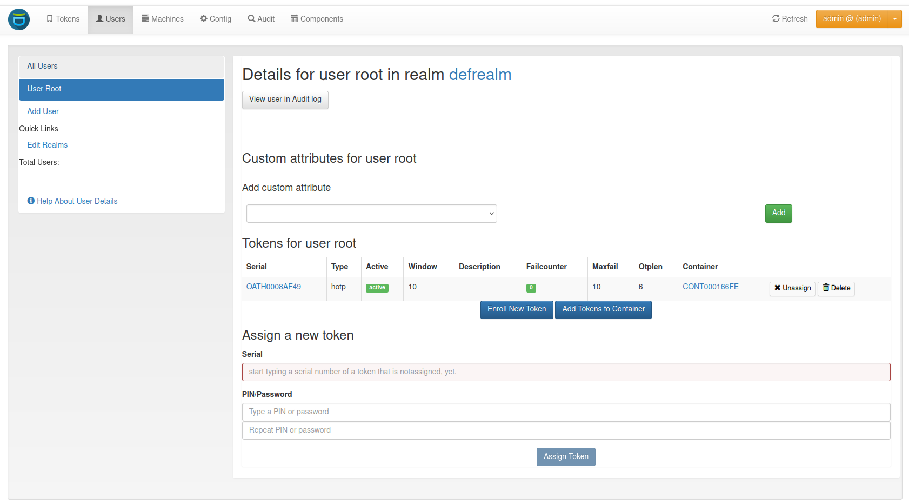

.. _user_details:

User Details
------------

When clicking on a username, you can see the user's details and perform
several actions on the user.

   *User Details.*

You see a list of the user's tokens and change to the :ref:`token_details`.
On the bottom, a list of the user's containers is displayed. You can click on the serial to change to the container
details (:ref:`container_view`).

Enable and Disable Tokens
.........................

A token can be enabled or disabled by clicking on the *Active* or *Deactivated* label. To change several tokens at
once, select them and click *(De)activate*.

Reset Failcounter
.................

To reset the failcounter of a token, click on the number in the failcounter column. To reset several tokens at once,
select them and click *Reset Failcounters*.

Unassign Tokens
...............

To unassign the user from tokens, select the tokens and click *Unassign*.

Delete Tokens
.............

Tokens can be deleted by selecting them and clicking *Delete*. You will be asked if you are
sure you want to delete the tokens. Confirm and the tokens will be deleted.

Enroll tokens
.............

In the user's details view you can enroll additional tokens to the user. Click *Enroll New Token*. On
the enrollment page the user is already selected and you only need to choose
what tokentype you wish to enroll for this user.

Add tokens to container
.......................

.. note:: This applies to the previous WebUI only, which is served when ``pi.cfg`` selects it as described in
   :ref:`legacy_webui`. In the WebUI, tokens are added to a container on the container details page, see
   :ref:`container_functionality`.

You can also add tokens to a container from the user's details view. Select the checkboxes for the tokens you want to add.
Either create a new container or select one from the drop-down list.

Assign tokens
.............

You can assign a new, already existing token to the user. Just start typing
the token serial number in the field *Assign Token to User*. The system will search for tokens, that are not
assigned yet and present you a list to choose from.

View Audit Log
..............

You can also click the button *Show audit log of user* which will take you to the
:ref:`audit` log with a filter on this very user, so that you will only see
audit entries regarding this user.

Edit user
.........

.. index:: Edit Users, Editable Resolver

If the user is located in a resolver, that is marked as editable, the
administrator will also see a button *Edit*. To read more about this,
see :ref:`manage_users`.
