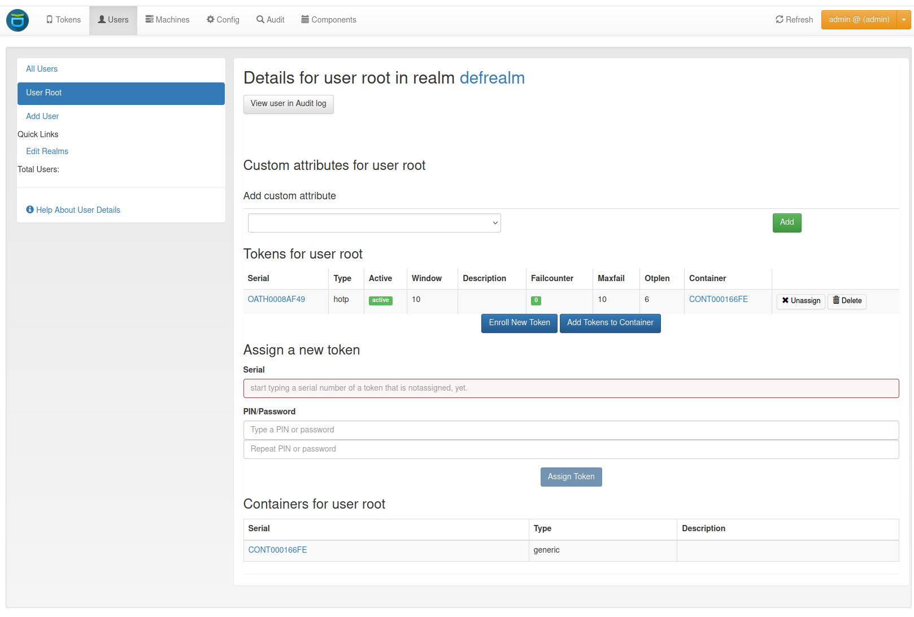

.. _user_details:

User Details
------------

When clicking on a username, you can see the users details and perform
several actions on the user.

   *User Details.*

You see a list of the users tokens and change to the :ref:`token_details`.
On the bottom, a list of the user's containers is displayed. You can click on the serial to change to the container
details (:ref:`container_view`).

Enable and Disable Tokens
.........................

A token can be enabled or disabled by clicking on the active or rather disable label.

Reset Failcounter
.................

To reset the failcounter of a token, click on the number in the failcounter column.

Unassign Tokens
...............

To unassign the user from a token click on the `unassign` button in the token's row.

Delete Tokens
.............

A token can be deleted by clicking on the `delete` button in the token's row. You will be asked if you are
sure you want to delete the token. Confirm and the token will be deleted.

Enroll tokens
.............

In the users details view you can enroll additional tokens to the user. In
the enrollment dialog the user will be selected and you only need to choose
what tokentype you wish to enroll for this user.

Add tokens to container
.......................

You can also add tokens to a container from the users details view. Select the checkboxes for the tokens you want to add.
Either create a new container or select one from the drop-down list.

Assign tokens
.............

You can assign a new, already existing token to the user. Just start typing
the token serial number. The system will search for tokens, that are not
assigned yet and present you a list to choose from.

View Audit Log
..............

You can also click *View user in Audit log* which will take you to the
:ref:`audit` log with a filter on this very user, so that you will only see
audit entries regarding this user.

Edit user
.........

.. index:: Edit Users, Editable Resolver

If the user is located in a resolver, that is marked as editable, the
administrator will also see a button "Edit User". To read more about this,
see :ref:`manage_users`.
