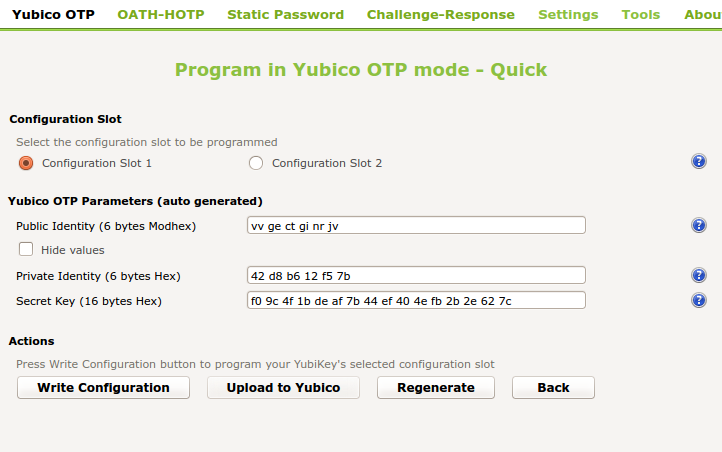
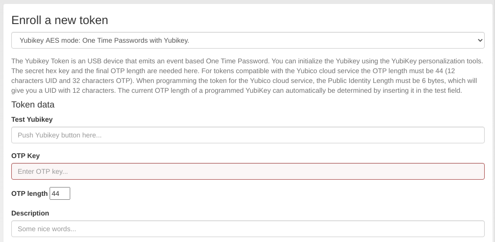
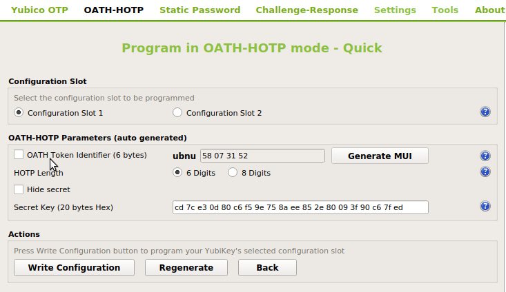
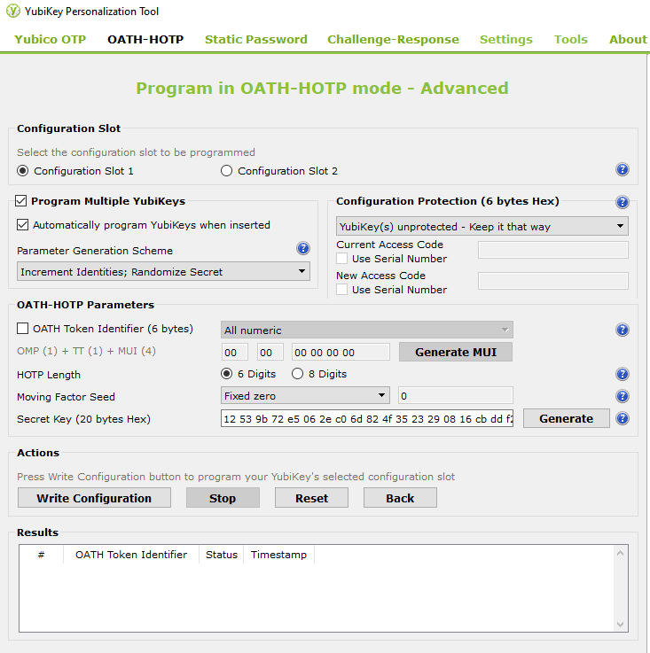

.. _yubikey_enrollment_tools:

Yubikey Enrollment Tools
------------------------

.. index:: Yubikey, Yubico AES mode, Yubikey OATH-HOTP mode

The Yubikey can be used with privacyIDEA in Yubico's own AES mode (*Yubico OTP*),
in the HOTP mode (*OATH-HOTP*) or the seldom used static password mode.

This section describes tools which can be used to initialize and enroll a
Yubikey with privacyIDEA.

If not using the :ref:`yubico_token` mode, the Yubikey has to be initialized/configured
which creates a new secret on the device that has to be imported to privacyIDEA.

privacyIDEA ships tools to (mass-)enroll Yubikeys in AES mode (Yubikey Token) or HOTP mode (HOTP Token).

.. _privacyideaadm_enrollment:

.. index:: privacyideaadm, admin tool

privacyidea CLI tool
~~~~~~~~~~~~~~~~~~~~

For Linux Clients, there is the ``privacyidea`` command line
client [#privacyideaadm]_, to initialize the Yubikeys. You can use the mass enrollment, which
eases the process of initializing a whole bunch of tokens.

Run the command like this::

   privacyidea -U https://your.privacyidea.server -a admin token \
   yubikey_mass_enroll --yubimode YUBICO

This command initializes the device and creates a new token with the
AES secret and prefix in privacyIDEA. You can enroll Yubikeys
in HOTP mode by using the option ``--yubimode HOTP`` which is also the default.
You can choose the slot with ``--yubislot``. For further help call
``privacyidea yubikey_mass_enroll`` with the ``--help`` option and refer to
the documentation of the tool [#privacyideaadmdocs]_.

You can also use ``yubikey_mass_enroll`` with the option ``--filename`` to
write the token configuration to the specified file, which can be imported
later via the privacyIDEA WebUI at Select Tokens -> Import Tokens.
There, select :ref:`import_oath_csv` and the file you just created.

.. _ykpersgui:

.. index:: Yubikey, Yubikey personalization GUI, Yubikey personalization tool

Yubikey Personalization GUI
~~~~~~~~~~~~~~~~~~~~~~~~~~~

You can also initialize the Yubikey with the official Yubico personalization GUI
[#ykpers]_ and use the obtained secret to enroll the Yubikey with privacyIDEA.
For both AES (Yubico OTP) and OATH-HOTP mode, there are two possibilities to initialize
the Yubikey with privacyIDEA.

Manual token enrollment
.......................

To initialize a single Yubikey in AES mode (Yubico OTP) use the *Quick* button and
copy the displayed secret labeled with "Secret Key (16 bytes Hex)" to the field *OTP Key*
on the enrollment form in the privacyIDEA WebUI.

   *Initialize a Yubikey in AES mode (Yubikey OTP)*

   *Enroll a Yubikey AES mode token in privacyIDEA*

In the field "Test Yubikey" touch the Yubikey button. This will determine the
length of the *OTP value* and the field *OTP length* is automatically filled.

.. note::
    The length of the unique passcode for each OTP is 32 characters at the end
    of the OTP value. The remaining characters at the beginning of the OTP value
    form the Public ID of the device. They remain constant for each
    OTP [#ykotp]_.

    privacyIDEA takes care of separating these parts but it needs to know the
    complete length of the OTP value to work correctly.

The process is similar for the HOTP mode. You have to deselect *OATH Token Identifier*.
Copy the shown secret to the HOTP :ref:`hotp_token_enrollment` form in privacyIDEA.

   *To initialize a single Yubikey in HOTP mode, deselect OATH Token Identifier.*

.. note::
   In the case of HOTP mode privacyIDEA can not necessarily distinguish a Yubikey in
   HOTP mode from a smartphone App in HOTP mode. Using the above mentioned mass-enrollment,
   the token serial number is used to distinguish these tokens.

Mass enrollment
...............

To initialize one or more Yubikeys it is convenient to write the created token secrets to a file
which can be imported in the privacyIDEA WebUI. To do this, activate *Settings* -> *Log configuration output*.
We recommend to select *Yubico format* since here privacyIDEA is able to detect the Yubikey mode and
sets the serial accordingly prepending UBOM or UBAM. PSKC format is also supported upon import.
You may also use the *Flexible format* to set custom token serials upon import with :ref:`import_oath_csv`.

To set a custom serial for Yubikey Tokens, set the *Flexible format* to::

   YUBIAES{serial}_{configSlot},{secretKeyTxt},yubikey

For Yubikeys in HOTP mode, set the output format as::

   YUBIHOTP{serial}_{configSlot},{secretKeyTxt},hotp,{hotpDigits}

Upon clicking *Write Configuration* for the first time, you be prompted to select an output file name and
the generated configuration is written both to the device and to the selected file. In the *Advanced* mode
select *Program Multiple Yubikeys* and *Automatically program Yubikeys when inserted* to program each Yubikey
immediately after detection.

   *Write Configuration initializes the Yubikey*

The tool is also able to do a mass-initialization by selecting *Program multiple Yubikeys* and
plugging one Yubikey after the other. During this process the token secrets are automatically
appended to the selected export file. Note again, that for HOTP, you have to deselect
*OATH Token Identifier*.

After mass-initialization, the token secrets have to be imported to privacyIDEA according to the
output format (see :ref:`import`).

.. rubric:: Footnotes

.. [#privacyideaadm] https://github.com/privacyidea/privacyideaadm/
.. [#privacyideaadmdocs] https://github.com/privacyidea/privacyideaadm/blob/master/doc/index.rst
.. [#ykpers] https://www.yubico.com/products/services-software/download/yubikey-personalization-tools/
.. [#ykotp] https://developers.yubico.com/OTP/OTPs_Explained.html
