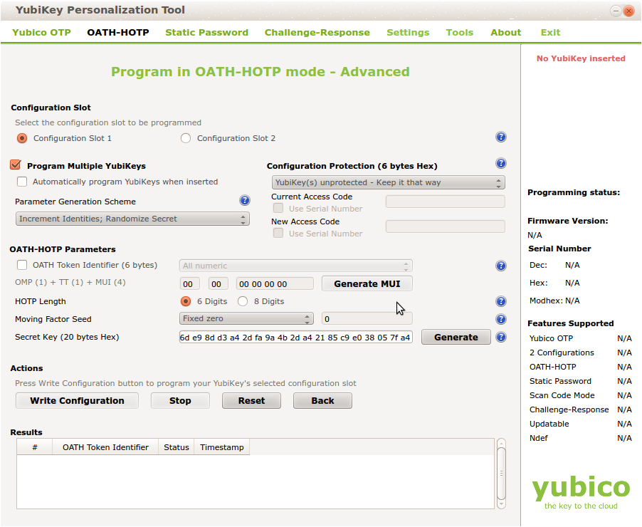

.. _import:

Import
======

.. index:: import, OATH CSV, Yubikey CSV, PSKC, RFC6030

Seed files that contain the secret keys of hardware tokens can be 
imported to the system via the menu *Import*.

The default import options are to import *SafeNet XML* file,
*OATH CSV* files, *Yubikey CSV* files or
*PSKC* files.

GPG Encryption
--------------

.. index:: GPG encryption, Encrypted Seed File

Starting with privacyIDEA 2.14 you can import GPG encrypted seed files.
All files mentioned below can be encrypted this way.

privacyIDEA needs its own GPG key. You may create one like this::

    mkdir /etc/privacyidea/gpg
    GNUPGHOME=/etc/privacyidea/gpg gpg --gen-key

Then make sure, that the directory /etc/privacyidea/gpg is *chown 700* for
the user *privacyidea*.

Now you can export the public key and hand it to your token vendor::

   GNUPGHOME=/etc/privacyidea/gpg gpg -a --export <keyid>

Now the token vendor can send the seed file GPG encrypted. You do not need to
decrypt the file and store the decrypted file on a network folder. Just
import the GPG encrypted file to privacyIDEA!

.. note:: Using the key *PI_GNUPG_HOME* in pi.cfg you can change the default
   above mentioned *GNUPGHOME* directory.

.. note:: privacyIDEA imports an ASCII armored file. The file needs to be
   encrypted like this:

      gpg -e -a -r <keyid>  import.csv

.. _import_oath_csv:

OATH CSV
--------

This is a very simple CSV file to import HOTP, TOTP or OATH tokens.
You can also convert your seed easily to this file format, to import
the tokens. 

The file format for TOTP tokens looks like this::

   <serial>, <seed>, TOTP, <otp length>, <time step>

For HOTP tokens like::

   <serial>, <seed>, [HOTP, <otp length>, <counter>]

For OCRA tokens it looks like this::

   <serial>, <seed>, OCRA, <ocra suite>

**serial** is the serial number of the token that will also be used
to identify the token in the database. Importing the same serial number 
twice will overwrite the token data.

**seed** is the secret key, that is used to calculate the OTP
value. The seed is provided in a hexadecimal notation. 
Depending on the length either the SHA1 or SHA256 hash algorithm 
is identified.

**type** is either HOTP, TOTP or OCRA.

**otp length** is the length of the OTP value generated by the token.
This is usually 6 or 8.

**time step** is the time step of TOTP tokens. This is usually
30 or 60.

**ocra suite** is the ocra suite of the OCRA token according to [#ocra]_.

For TAN tokens it looks like this::

   <serial>, <n/a>, TAN, <list of tans>

The list of tans is a whitespace separated list.

.. note:: The Hash algorithm (SHA1, SHA256, SHA512) is derived from the length of the **seed**.
   If the length of the seed does not match any Hash algorithm, the default SHA1 is used.

Import format version 2
~~~~~~~~~~~~~~~~~~~~~~~

A new import format allows to prepend a user, to whom the imported token should be assigned.

The file format needs to start with the first line

   # version: 2

and the first three colums will be the user:

   <username>, <resolver>, <realm>, <serial>, <seed>, <type>, ...

.. note:: The import will bail out, if a specified user does not exist.

Yubikey CSV
-----------

Here you can import the CSV file that is written by the :ref:`ykpersgui` [#yubipers]_.
privacyIDEA can import all Yubikey modes, either Yubico mode or HOTP mode.

.. note:: The Yubikey in HOTP mode defaults to the Hash algorithm SHA1.

For more information about enrolling Yubikeys see :ref:`yubikey_enrollment_tools`.

PSKC
----

The *Portable Symmetric Key Container* is specified in [#RFC6030]_.
OATH compliant token vendors provide the token seeds in a PSKC file.
privacyIDEA lets you import PSKC files.
All necessary information (OTP length, Hash algorithm, token type) are read
from the file.

.. note:: In PSKC the Hash algorithm is specified in the ``<Suite>`` tag.
   If it is not specified, SHA1 is used as the default. The length of the
   seed is *not* used to determine the Hash algorithm.

PSKC files can be encrypted - either with a password or an AES key. You can
provide this during the upload.

SafeNet XML
-----------

Safenet or former Aladdin provided seed files in their own XML format.
This is the format to choose, if you have a file, that looks like this::

    <Tokens>
        <Token serial="00040008CFA5">
        <CaseModel>5</CaseModel>
        <Model>101</Model>
        <ProductionDate>02/19/2009</ProductionDate>
        <ProductName>Safeword Alpine</ProductName>
        <Applications>
        <Application ConnectorID="{ab1397d2-ddb6-4705-b66e-9f83f322deb9}">
        <Seed>123412354</Seed>
        <MovingFactor>1</MovingFactor>
        </Application>
        </Applications>
        </Token>

        <Token ...>
        ...
        </Token>
     </Tokens>

.. note:: The HASH algorithm defaults to SHA1. Unless the length of the seed is 64 characters, then SHA256
   is assumed.

.. note:: This format is deprecated. Safenet nowadays might provide you an XML file, which is probably a PKCS file.
   Please check the file contents!

.. [#ocra] http://tools.ietf.org/html/rfc6287#section-6
.. [#yubipers] http://www.yubico.com/products/services-software/personalization-tools/use/
.. [#RFC6030] https://tools.ietf.org/html/rfc6030
